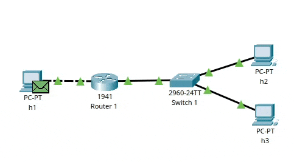

# Trabajo Práctico N° 1

### Nombres _(por órden alfabético)_

_Gil Cernich Manuel (manuel.gil.cernich@mi.unc.edu.ar)_
_González Damián M. (damian.gonzalez@mi.unc.edu.ar)_
_Zuñiga Ivan A. (ivan.zuniga@mi.unc.edu.ar)_

### Nombre del grupo

_epsilon_

### Nombre del centro educativo

_Facultad de Ciencias Exactas, Físicas y Naturales; Universidad Nacional de Córdoba_

### Nombre del curso

_Redes de Computadoras_

### Profesores _(por órden alfabético)_

_Henn Santiago M._
_Oliva Cuneo Facundo_

### Fecha

_26-03-2025_

---

# Resumen

Este trabajo indaga en los protocolos:
- **ARP**, perteneciente a la capa de **acceso a la red** (de acuerdo al modelo TCP/IP, y de ahora en más salvo que se diga lo contrario nos referiremos siempre a este modelo). Traduce direcciones IP a MAC en redes locales.
- **IPv4** e **IPv6**, pertenecientes a la capa de **internet**. Direccionan y enrutan paquetes de datos entre dispositivos de una red.
- **NDP**, perteneciente a la capa de **internet** y que puede considerarse un protocolo hijo del protocolo **IPv6**. Resuelve direcciones IP a MAC, y realiza otras funciones de descubrimiento en la red. Es análogo a ARP, utilizado para IPv4.
- **ICMP**, perteneciente a la capa de **internet**, que tiene sus versiones compatibles con IPv4 e IPv6 respectivamente. Permite el envío de mensajes de control de errores en redes, como `ping` y `traceroute`.

**Palabras clave**: _IPv4, ARP, IPv6, NDP, ICMP, DHCP, emuladores de redes, simuladores de redes._

---

# Introducción

En esta primera parte del trabajo práctico construiremos un diagrama de red utilizando el software de simulación Packet Tracer. Se procederá a configurar los 5 dispositivos, tal como está definido en la **Tabla de asignación de direcciones propuestas**. A continuación, a posteriori de abarcar cuestiones del plano teórico, se procederá a realizar una serie de pruebas entre los hosts, dejando constancia del resultado, y respondiendo una serie de preguntas al respecto.

---

# Marco teórico

De los protocolos mencionados, el mas explotado en este trabajo es ICMP, que tiene como objetivo principal, proveer funcionalidades de chequeo de performance y errores. Este protocolo tiene su versión _podada_ tanto para IPv4, como para IPv6; ambas dos se utilizan aquí.  
A su vez, ICMP dependiendo de la versión para la cual se use, IPv4 o IPv6, hará uso de ARP o NDP respectivamente. Esto se debe a que cuando uno hace uso de una de las funcionalidades, por ejemplo `ping`, uno pasa el IP de la máquina _target_. En una red local, los dispositivos se comunican a nivel Capa OSI 2, es decir que debe haber un mapeo entre el IP destino, y la MAC de ese destino. Este mapeo debe encontrarse en la tabla ARP del host origen. Si no se encuentra, se envía un mensaje de tipo _broadcast_ a la red, de manera de añadir esta entrada. Luego recién puede haber comunicación entre estos dos hosts.  
Caso similar se da al utilizar IPv6, donde las funcionalidades de ICMP hacen uso de NDP.

# Desarrollo

## 2)

Para este propósito, y los items de práctica siguientes se utilizó Cisco Packet Tracer.


| Ejemplo | Tabla |
|-----------|-------|
| Header | Title |
| Paragraph | Text |

```
// Más código
{
"firstName": "John",
"lastName": "Smith",
"age": 25
}
```

---

# Desarrollo

## 4)  

Se adjuntan imágenes de las pruebas de conectividad exitosos:

h1 → h2


h1 → h3


## 5)

Se adjuntan imágenes de las pruebas de conectividad exitosos:

h1 → h2
  


h1 → h3


## 6)

### a.

#### Análisis de Comunicaciones ARP

Cuando h1 (192.168.1.10) intenta comunicarse con h2 (192.168.2.10), se producen las siguientes comunicaciones ARP:

#### Primer intercambio ARP: h1 → Router 1

#### ARP Request desde h1:

- h1 necesita enviar datos a 192.168.2.10 (h2)
- h1 determina que h2 está en otra red (192.168.2.0/24)
- h1 debe enviar el paquete a su gateway (192.168.1.11)
- h1 emite un broadcast ARP (FF:FF:FF:FF:FF:FF): "¿Quién tiene la IP 192.168.1.11?"

#### Contenido del paquete:

- MAC origen: [MAC de h1]
- MAC destino: FF:FF:FF:FF:FF:FF (broadcast)
- Tipo: ARP Request (1)
- IP solicitada: 192.168.1.11

#### ARP Reply desde Router 1:

- Router 1 recibe el broadcast
- Router 1 responde directamente a h1: "Yo tengo 192.168.1.11 y mi MAC es [MAC del Router]"

#### Contenido del paquete:

- MAC origen: [MAC de Router-eth0]
- MAC destino: [MAC de h1]
- Tipo: ARP Reply (2)
- IP: 192.168.1.11
- MAC respondida: [MAC de Router-eth0]

#### Segundo intercambio ARP: Router 1 → h2

#### ARP Request desde Router 1:

- Router 1 necesita enviar el paquete a h2 (192.168.2.10)
- Router 1 emite un broadcast ARP en la red 192.168.2.0/24: "¿Quién tiene la IP 192.168.2.10?"

#### Contenido del paquete:

- MAC origen: [MAC de Router-eth1]
- MAC destino: FF:FF:FF:FF:FF:FF (broadcast)
- Tipo: ARP Request (1)
- IP solicitada: 192.168.2.10

#### ARP Reply desde h2:

- h2 recibe el broadcast
- h2 responde directamente al Router 1: "Yo tengo 192.168.2.10 y mi MAC es [MAC de h2]"

#### Contenido del paquete:

- MAC origen: [MAC de h2]
- MAC destino: [MAC de Router-eth1]
- Tipo: ARP Reply (2)
- IP: 192.168.2.10
- MAC respondida: [MAC de h2]

#### Proceso de traducción de direcciones

El protocolo ARP permite traducir direcciones IP (lógicas, capa 3) a direcciones MAC (físicas, capa 2) siguiendo estos pasos:
1. El dispositivo emisor consulta su tabla ARP local.
2. Si no tiene la entrada correspondiente, emite un ARP Request (broadcast).
3. El dispositivo con la IP solicitada responde con un ARP Reply.
4. El emisor actualiza su tabla ARP con la información recibida.
5. Esta información se almacena en memoria para futuras comunicaciones.

Esta traducción es necesaria porque las tramas Ethernet (capa 2) requieren direcciones MAC, mientras que las aplicaciones trabajan con direcciones IP (capa 3).

#### Ejemplo gráfico del proceso ARP



### b.

#### Direcciones IP en los data-gramas durante la comunicación entre h1 y h2

En la topología de red mostrada previamente, cuando se realiza un ping desde h1 hacia h2, el encabezado IP del PDU (Protocol Data Unit) enviado contiene la siguiente información:
-  **Dirección IP de origen**: 192.168.1.10 (perteneciente a h1)
-  **Dirección IP de destino**: 192.168.2.10 (perteneciente a h2)

Ejemplo gráfico de lo mencionado anteriormente:


Lo mismo ocurre cuando se realizar un ping desde h1 hacia h3, lo que cambia es la dirección de destino que será la de h3.

## 7)  

### a.

#### Análisis de comunicaciones NDP en tráfico ICMPv6 entre h1 y h3

Al iniciar tráfico ICMPv6 entre h1 (2001:aaaa:bbbb:1::10/64) y h3 (2001:aaaa:cccc:1::11/64), se producen varias comunicaciones NDP (Neighbor Discovery Protocol). Estos mensajes sustituyen la funcionalidad de ARP en IPv4.

#### Tipos de mensajes NDP observados

#### 1. Neighbor Solicitation (NS) de h1 al Router 1

-  **Dirección IPv6 origen**: 2001:aaaa:bbbb:1::10 (h1)
-  **Dirección IPv6 destino**: ff02::1:ff00:11 (dirección multicast solicited-node para 2001:aaaa:bbbb:1::11)
-  **Propósito**: h1 necesita resolver la dirección MAC del Router 1 (su gateway) antes de enviar el paquete

#### 2. Neighbor Advertisement (NA) del Router 1 a h1

-  **Dirección IPv6 origen**: 2001:aaaa:bbbb:1::11 (Router 1 - interfaz eth0)
-  **Dirección IPv6 destino**: 2001:aaaa:bbbb:1::10 (h1)
-  **Propósito**: El Router 1 responde con su dirección MAC  

#### 3. Neighbor Solicitation (NS) del Router 1 a h3

-  **Dirección IPv6 origen**: 2001:aaaa:cccc:1::12 (Router 1 - interfaz eth1)
-  **Dirección IPv6 destino**: ff02::1:ff00:11 (dirección multicast solicited-node para 2001:aaaa:cccc:1::11)
-  **Propósito**: El Router 1 necesita resolver la dirección MAC de h3

#### 4. Neighbor Advertisement (NA) de h3 al Router 1

-  **Dirección IPv6 origen**: 2001:aaaa:cccc:1::11 (h3)
-  **Dirección IPv6 destino**: 2001:aaaa:cccc:1::12 (Router 1 - interfaz eth1)
-  **Propósito**: h3 responde con su dirección MAC

#### Ejemplo gráfico del proceso NDP


## 3)

Un simulador es una abstracción de un emulador. Un emulador es una abstracción de la realidad. El emulador replica lo mas fielmente posible, los aspectos de la realidad que quiere _copiar_. El simulador, por otro lado, se abstrae un poco mas de la realidad versus el emulador. En el caso del simulador, no necesariamente se tienen en cuenta _todos_ los aspectos que hacen a la realidad de la _cosa_ que se quiere copiar, sino solo los necesarios para demostrar cierto objetivo. En cuanto a hardware y software, un emulador de una _cosa_ lógicamente consume muchos mas recursos que un simulador de la _cosa_, porque este último maneja mucha menos información que un emulador.

## 6)

### c)

1. El host h1 detecta que h2 no está en su misma subred, por lo tanto envía el paquete al default gateway: el router.
2. El router recibe el paquete, observa la IP de destino y se da cuenta que está en la subred conectada a su otra NIC, sin embargo primero necesita conocer su dirección MAC, previo a re-encapsular el paquete. Puede tener la dirección MAC asociada a la IP destino o no. Este mapeo se encuentra en la tabla ARP del router. Suponiendo que no tiene este mapeo hecho, enviará un _ARP request_ a la subred destino, esto es un mensaje broadcast. El switch aquí hace de _pasamanos_. h2 recibe el _ARP request_ y _responde con su MAC_. El router ahora tiene en su tabla ARP la asociación entre IP destino y su respectiva MAC.
3. El router encapsula el paquete del host h1 dentro de una trama Ethernet (o de carácter similar (misma capa)) y la envía en dirección a h2.
4. El switch recibe este paquete, ya que se encuentra en el medio entre el router y h2. Lo que hace es simplemente reenviar el paquete al puerto de salida que tiene mapeada la dirección MAC destino.

### d)

El switch se utiliza simplemente para ampliar una red. En una hipotética red local, si está comprendida por dos computadoras, con una conexión punto a punto basta; peor se si suma una tercer computadora, y no se desean agregar mas NICs que la única que viene con cada host, entonces será necesaria la utilización de un switch. Los switches pueden anidarse para crear redes mas grandes. Un switch opera en la capa OSI 2, donde maneja la identidad de cada host miembro de la red mediante una **identificación única** concerniente a determinada NIC conocida como MAC.  
El switch no tiene asignada direcciones IP en sus interfaces porque sabe nada de ese protocolo. Ese protocolo pertenece a la capa OSI 3, gracias a esto, un switch no necesita gran capacidad computacional, sino algo reducida con respecto a las capacidades que tiene un router.

### e)

Las entradas de la tabla ARP (IP vs MAC) de h1 contiene solamente su default gateway: el router.

### f)

Las entradas de la tabla ARP de h3 son:
- default gateway: router
- h2

### g)

Al router tener 2 NICs, tiene 2 tablas ARP. Una de ellas tendrá como única entrada h1. La otra tendrá como entradas:
- h2
- h3

### h)

Las dirección de broadcast de IPv4 son XXX.XXX.XXX.255; es decir que utilizan el último valor posible del último octeto de la subred a la cual quiere enviársele un mensaje broadcast. La utilidad de un mensaje broadcast es principalmente descubrir hosts, en el caso del protocolo DHCP o ARP; aunque también puede utilizarse para otros propósitos específicos a ciertas aplicaciones. Todos los hosts de una subred recibirán un mensaje broadcast direccionado a dicha respectiva subred.

## 7)

### b) 

Sí, lo reemplaza en IPv6. Intenta ser mas _lite_, y provee capacidades extras.

### c)

Las funciones o funcionalidades principales son:
- Reemplazando a ARP, sigue siendo necesario un mapeo de IP vs MAC. Esto se sigue haciendo, mediante nuevas metodologías conocidas como Neighbor Solicitation (NS) y Neighbor Advertisement (NA).
- La autoconfiguración de direcciones IP. Mientras que en IPv4 era menester el uso de DHCP para la obtención dinámica de direcciones ip, NDP no necesita de ello, mediante el sistema SLAAC puede autoasignarse una dirección IP, principalmente basada en su propia dirección MAC.
- Otras funcionalidades _secundarias_ como la _detección de duplicación de direcciones ip_, _router solicitation_; en routers: _router advertisement_, y _redirection_, que permite a los routers redirigir el tráfica hacia una aparente mejor ruta.

### d)

En IPv6 hay una flexibilidad mayor para hacer broadcast; es posible hacer un broadcast a todos los hosts no-routers de la red local mediante `ff02::1`, o hacer uno a todos los routers _al alcance_ con `ff02::2`. Para esto último, los routers deben tener habilitada la funcionalidad.

### e)

En IPv6, las direcciones **link-local** (LLA) son válidas solo dentro de la misma red local. Las **unique-local** (ULA) son válidas dentro de una red privada, tampoco tiene validez en internet al igual que las LLA. Vale aclarar que la diferencia entre LLA y ULA radica en que una ULA puede aplicar a una WAN que no necesariamente es parte de internet. Por último las direcciones **global** (GUA) son públicas a todo el internet.

# Parte 2

## 1)

## 2)

El checklist fué confeccionado [aquí](./assets/checklist_parte_2.txt).

De esta forma fué configurado Putty para acceder al switch:


Los comandos de:

- reinicio a configuración de fábrica, y configuración inicial;
- configuración de contraseñas;
- configuración de port mirroring en puerto 3

... ejecutados en el switch fueron los siguientes:

```text
enable
erase startup-config
reload

enable
configure terminal
hostname Cisco2950-24
line console 0
password cisco
login
end

configure terminal
enable secret epsilon
exit

configure terminal
line vty 0 15
password epsilon_remote
login
end

configure terminal
service password-encryption
end

configure terminal
monitor session 1 source interface fastethernet0/1
monitor session 1 source interface fastethernet0/2
monitor session 1 destination interface fastethernet0/3
end

copy running-config startup-config
```

La subred configurada en las 3 computadoras que se utilizaron para el experimento se configuraron en 192.168.0.X, máscara de subred 255.255.255.0. Las respectivas IP son 192.168.0.10 para la conectada al puerto 3 (mirroring), 192.168.0.20 al puerto 1, y 192.168.0.30 al puerto 2.

---

## 6)

### a)  

Antes de iniciar el intercambio de paquetes ICMP, la tabla ARP se encontraba vacía, sin ninguna asociación entre direcciones IP y direcciones MAC. Esta ausencia de entradas en la tabla refleja que aún no se había establecido comunicación entre los dispositivos de la red, como se evidencia en la siguiente captura:


Luego de la ejecución de los comandos ping, la tabla ARP se actualizó automáticamente, registrando las direcciones MAC de origen correspondientes a cada uno de los hosts que enviaron solicitudes ICMP. Este proceso de resolución de direcciones permitió completar la tabla con la información necesaria para establecer la comunicación a nivel de enlace de datos entre los dispositivos de la red.


  
### b) 

En los datagramas IP, las direcciones IP se encuentran en la cabecera IPv4 del paquete, específicamente en los campos de dirección IP de origen y dirección IP de destino.

Por ejemplo, en un datagrama IP capturado durante la comunicación entre dos hosts, podemos observar:


- **Dirección IP de origen:** 192.168.0.20 → Esta es la dirección del dispositivo que envía el datagrama
- **Dirección IP de destino:** 192.168.0.30 → Esta es la dirección del dispositivo al que va dirigido el datagrama

# Conclusiones

Este trabajo nos permitió implementar y analizar una red dual-stack IPv4/IPv6 utilizando herramientas de simulación de redes. Los resultados obtenidos demuestran claramente las diferencias entre los mecanismos de comunicación de ambos protocolos.

Se observó que mientras IPv4 utiliza ARP con mensajes broadcast para resolver direcciones físicas, IPv6 implementa NDP con direcciones multicast solicited-node, resultando en una comunicación más eficiente. Las pruebas de conectividad mediante ICMP permitieron verificar el correcto funcionamiento del enrutamiento entre las distintas redes (192.168.1.0/24 y 192.168.2.0/24).

El análisis del tráfico reveló cómo el router determina las rutas apropiadas basándose en sus tablas de enrutamiento, mientras que el switch opera exclusivamente en capa 2 sin necesidad de direccionamiento IP.

Este laboratorio proporcionó una experiencia práctica fundamental para comprender los protocolos de comunicación modernos y las ventajas que IPv6 ofrece frente a las limitaciones de IPv4.
# Parte 2

## 1)

El Cisco Catalyst 2950 es una serie de switches de configuración fija y administrados con capacidad de 10/100 Mbps, diseñado para pequeñas y medianas redes. Estos switches incluyen el software Standard Image (SI), que proporciona funcionalidades básicas para datos, voz y video.

### Características de Hardware

#### Puertos y Conectividad
  - Disponible en configuraciones de 12, 24 o 48 puertos 10/100 Mbps según el modelo
  - Puertos de enlace ascendente Gigabit Ethernet (modelos 2950SX con 2 puertos 1000BASE-SX fijos)
  - Soporte para modos de comunicación Half-Duplex y Dúplex completo

#### Memoria y Rendimiento
  - 16 MB de DRAM para procesamiento
  - 8 MB de memoria Flash para almacenamiento del sistema operativo
  - 8 MB de buffer de paquetes compartido por todos los puertos
  - Capacidad para configurar hasta 8,000 direcciones MAC
  - Rendimiento de conmutación de 13.6 Gbps (en modelos superiores)
  - Tasas de reenvío de entre 1.8 Mpps (modelo 2950-12) hasta 10.1 Mpps (modelos 2950T-48 y 2950SX-48)

#### Diseño Físico
  - Factor de forma: 1U para montaje en rack
  - Dimensiones: 17.5 x 9.5 x 1.7 pulgadas (ancho x profundidad x altura)
  - Formato apilable y adecuado para instalación en armarios de telecomunicaciones

#### Funcionalidades Avanzadas

Una de las características más importantes del Catalyst 2950 es la capacidad para implementar VLANs, permitiendo segmentar una red física en múltiples redes virtuales. Esto proporciona:
  - Mayor seguridad al aislar grupos de trabajo
  - Mejor rendimiento al reducir dominios de colisión y broadcast
  - Facilidad de administración al agrupar usuarios lógicamente independientemente de su ubicación física

#### Seguridad de Red
  - Secure Shell version 2 (SSHv2) para encriptar información administrativa
  - Private VLAN Edge para aislar puertos en un switch
  - Seguridad basada en usuarios o direcciones MAC
  - Control de acceso mediante autenticación IEEE 802.1x

#### Rendimiento y Disponibilidad
  - Fast EtherChannel para proporcionar alto rendimiento en enlaces entre switches, routers y servidores
  - Múltiples enlaces ascendentes Gigabit para aumentar el ancho de banda hacia el núcleo de la red

## 2)

## 3)

### a)

### b)

### c)

El enrutador determina la comunicación entre un host y otro siguiendo estos pasos:

1. **Verificación de la dirección IP de destino**
  - Cuando Cliente 1 envía un paquete ICMP a Cliente 2, primero verifica si la IP de destino está en la misma subred.
  - Si están en redes diferentes, Cliente 1 envía el paquete al gateway predeterminado (el router).

2. **Tabla de enrutamiento**
  - El router revisa su tabla de enrutamiento para determinar la mejor ruta hacia la red de Cliente 2.
  - Si tiene una entrada para la red de destino, reenvía el paquete por la interfaz adecuada.
  - Si no tiene una ruta, puede usar una ruta por defecto o descartar el paquete.

3. **Encapsulación de la trama**
  - El router cambia la dirección MAC de origen y destino en la trama Ethernet y la envía al switch para que llegue a Cliente 2.

4. **Respuesta del Cliente 2**
  - Cliente 2 responde con un paquete ICMP siguiendo el mismo proceso, pero en dirección inversa.

### d)

El switch se usa para interconectar dispositivos dentro de la misma red (LAN) y mejorar la eficiencia en la transmisión de datos. Sus funciónes principales son aprender direcciones MAC y reenviar trafico solo a los puertos correctos, reducir las colusiones en la red y usar la conmutacion por hardware, y optimizar el rendimiento mediante full-duplex.

Los switches de capa 2, como el Cisco Catalyst 2950, no necesitan direcciones IP en sus interfaces porque trabajan con direcciones MAC y no con direcciones IP para reenviar tráfico. Aun que un siwtch puede tener una direcciones IP, esta solo se usa para administracion remota y no para el trafico de datos.

---

# Discusión y conclusiones

A lo largo de este trabajo, se han explorado y analizado diversos protocolos fundamentales para la comunicación en redes, incluyendo ARP, IPv4, IPv6, NDP e ICMP, así como la funcionalidad de switches y routers en la interconexión de dispositivos. Mediante la simulación en Cisco Packet Tracer, se ha podido observar el comportamiento de estos protocolos en entornos de red, destacando la interacción entre dispositivos y la resolución de direcciones a distintos niveles del modelo TCP/IP.

Uno de los temas clave fue el funcionamiento de ICMP en la verificación de conectividad y la detección de problemas en la red. En IPv4, ARP es utilizado para mapear direcciones IP a MAC, mientras que en IPv6, esta función es reemplazada por NDP.

La simulacion también permitió comprender cómo un router determina el enrutamiento de paquetes entre subredes, haciendo uso de su tabla de enrutamiento y protocolos de descubrimiento de vecinos. Así mismo, se analizó el rol del switch en la segmentación de redes locales, facilitando la comunicación eficiente a nivel de capa 2 y reenvío de tramas basadas en direcciones MAC.

En cuanto al hardware, el Cisco Catalyst 2950 es una solución confiable para redes pequeñas y medianas, ofreciendo capacidades avanzadas como VLANs y seguridad basada en MAC. 

---

# Referencias

- Stallings, W. (2004). _Comunicaciones y Redes de Computadores. Séptima edición_. Pearson.
- Agilent Technologies (2006). _Network Communication Protocols_.
- Autores varios (16 de Marzo de 2025). _[Internet Control Message Protocol](https://en.wikipedia.org/wiki/Internet_Control_Message_Protocol)_. Wikipedia.
