# Trabajo Práctico N° 2

### Nombres _(por órden alfabético)_
_Gil Cernich Manuel (manuel.gil.cernich@mi.unc.edu.ar)_  
_González Damián M. (damian.gonzalez@mi.unc.edu.ar)_  
_Zuñiga Ivan A. (ivan.zuniga@mi.unc.edu.ar)_

### Nombre del grupo  
_epsilon_  

### Nombre del centro educativo

_Facultad de Ciencias Exactas, Físicas y Naturales; Universidad Nacional de Córdoba_

### Nombre del curso

_Redes de Computadoras_

### Profesores _(por órden alfabético)_

_Henn Santiago M._  
_Oliva Cuneo Facundo_

### Fecha

_17-04-2025_

---

# Resumen

Este trabajo constó en su mayor medida de una práctica de laboratorio, donde posterioramente a configurar una red de area local con los hosts disponibles, se procedió a realizar una serie de pruebas para determinar el ancho de banda local, el ancho de banda hacia/desde el exterior, utilizando el protocolo TCP, y también el protocolo UDP. Posteriormente, se anota lo observado y elaboran conclusiones. 

**Palabras clave**: _IPv4, ICMP, TCP, UDP, iperf3, Wireshark._

---

# Introducción

Este trabajo está guiado por una serie de items/preguntas, que van desde el 1, al 5. Hubo que seguir estos items en orden, ya que el siguiente depende del anterior. Cada uno de los items está acompañado por capturas de pantalla, realizadas en los diferentes hosts de la red local configurada.

---

# Metodología

## 1) **Configuración de IPs Fijas y Pruebas de Conectividad**

Se configuraron dos computadoras del grupo con direcciones IP estáticas como se muestra a continuación:  

### Host 1:  

- **IP**: 10.10.10.10
- **Máscara de subred**: 255.255.255.0
- **Gateway**: 10.10.10.1

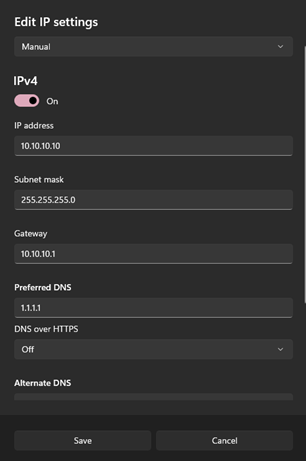

### Host 2:

- **IP**: 10.10.10.11
- **Máscara de subred**: 255.255.255.0
- **Gateway**: 10.10.10.1
- **DNS**: 1.1.1.1

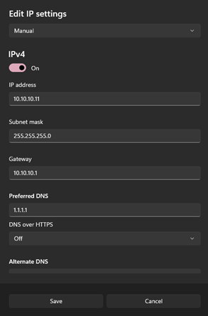

Se realizaron pruebas de conectividad entre ambos hosts utilizando ICMP (comando `ping`):

- `ping` de 10.10.10.10 a 10.10.10.11:

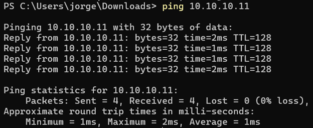

- `ping` de 10.10.10.11 a 10.10.10.10:

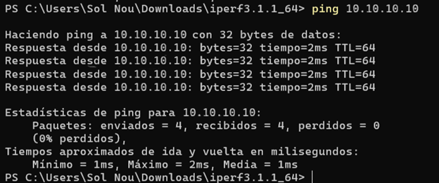

- `ping` a host externo (192.168.3.88):

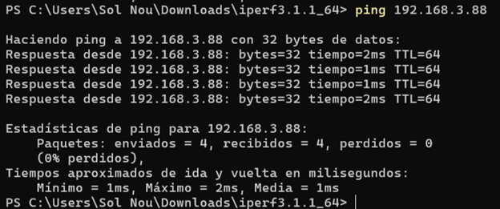

Se verifica conectividad exitosa entre computadoras del mismo grupo y con al menos un grupo adicional. Las configuraciones IP están correctamente aplicadas y funcionales.

## 2) Comandos Básicos de _iperf3_

Se utilizaron los siguientes comandos de _iperf3_ para realizar pruebas de rendimiento de red:

| Comando             | Descripción                                                                                          |
|:--------------------|:-----------------------------------------------------------------------------------------------------|
| `iperf3 -s`         | Inicia iperf3 en modo servidor.                                                                      |
| `iperf3 -c <IP>`    | Inicia iperf3 en modo cliente hacia la IP indicada.                                                  |
| `iperf3 -c <IP> -u` | Ejecuta iperf3 en modo cliente usando el protocolo UDP. De no usar \-u, se utiliza el protocolo TCP. |
| `-t <segundos>`     | Define la duración de la prueba.                                                                     |
| `-p <puerto>`       | Especifica el puerto de conexión.                                                                    |
| `-b <ancho>`        | Establece el ancho de banda (solo para UDP).                                                         |
| `-l <long>`         | Especifica el tamaño del paquete.                                                                    |
| `-i <intervalo>`    | Intervalo entre reportes.                                                                            |

## 3) Pruebas y Capturas con _Wireshark_

Se realizaron pruebas utilizando _iperf3_ con los protocolos TCP y UDP, capturando el tráfico con Wireshark. Se utilizaron las siguientes configuraciones:

- Cliente TCP a servidor local (10.10.10.10).  
- Cliente UDP a servidor local (10.10.10.10).  
- Cliente TCP a servidor externo (34.176.225.102).  
- Capturas con Wireshark filtrando por IP de origen/destino y puerto 5201.

### Cliente TCP hacia 10.10.10.10

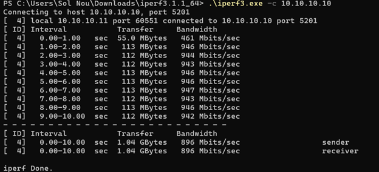

### Servidor TCP en 10.10.10.10

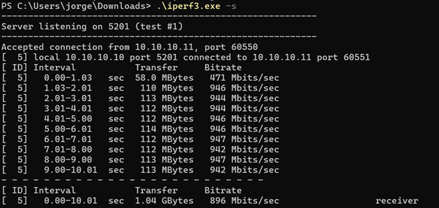

### Cliente UDP hacia 10.10.10.10

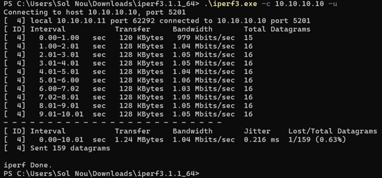

### Servidor UDP en 10.10.10.10

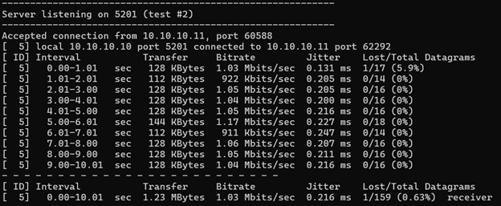

### Tráfico TCP capturado con Wireshark

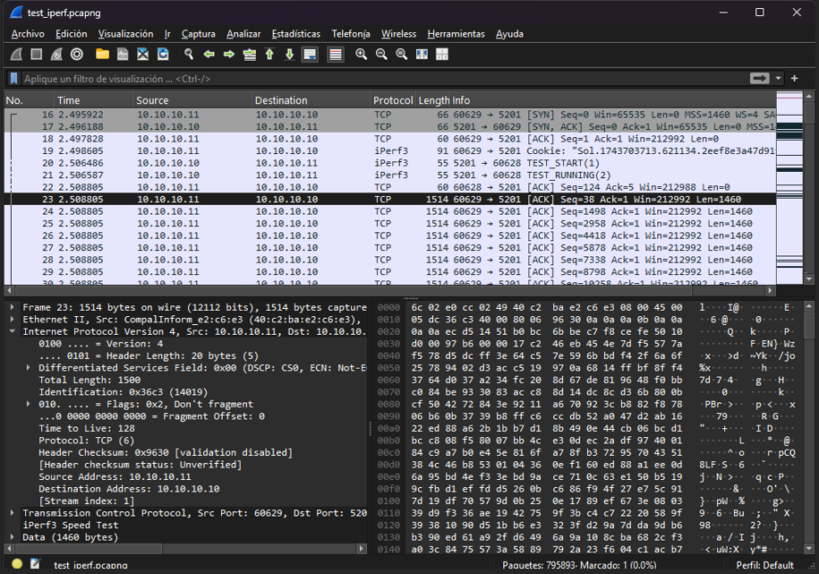

### Tráfico UDP capturado con Wireshark

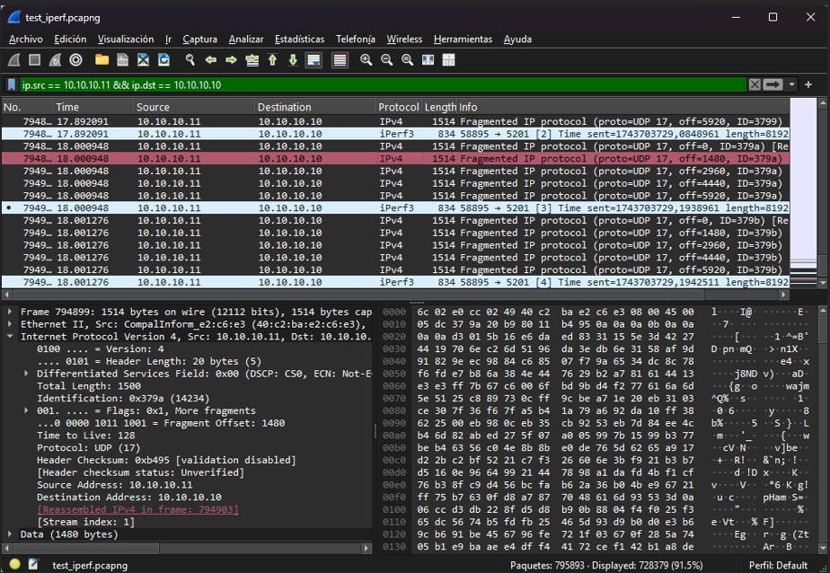

## 4) Conclusiones Sobre las Pruebas

Las pruebas tuvieron una duración de 10 segundos cada una.  

El tamaño promedio de los paquetes, utilizando el protocolo TCP fué de 104 MB. El tamaño promedio de los paquetes, utilizando el protocolo UDP fué de 123 KB.  

Las pruebas revelaron las siguientes características de comportamiento entre los protocolos:  

- **TCP, en LAN**: Ancho de banda promedio: 896 Mbps, sin pérdida de paquetes ni jitter.
- **TCP, hacia servidor externo**: Ancho de banda promedio: 3.61 a 3.67 Mbps. Mayor latencia, menor rendimiento.
- **UDP, en LAN**: Ancho de banda promedio: 1.03 Mbps (), pérdida de paquetes: 1/159 (\~0.6%), jitter: 0.216 ms. **NOTA**: Lamentablemente, nos dimos cuenta posteriormente a las prácticas de laboratorio, que iperf3 por defecto, para UDP, para no congestionar la red, establece un tamaño máximo de ancho de banda de \~1 Mbps. Nosotros debimos setear este valor *con \-b*, a uno alto, incluso mas alto que el ancho de banda promedio otorgado  en TCP, que no es limitado por iperf3, y de esa forma ver si podía alcanzar valores mas altos. Lo que sí está claro es que con UDP se detecta pérdida de paquetes y jitter, a diferencia de TCP. La espectativa de haberlo hecho así, es haber encontrado que UDP puede superar el ancho de banda existente con TCP, hipotéticamente de forma ilimitada, saturando la red, aunque ello limitado por la velocidad máxima soportada por la NIC del host con menor velocidad dentro de la comunicación, o bien por el cableado, switch, router, etc.

En base a lo experimentado, se puede reconocer:

- TCP es más confiable para transferencia de datos.
- UDP es menos confiable para transferencia de datos, aunque alcanzaría velocidades superiores a TCP.
- Se observa clara diferencia entre comunicación dentro de la red local versus conexión externa.

## 5) Prueba hacía Servidor Externo

Se realizó una prueba desde el host del grupo hacia el servidor externo 34.176.225.102 utilizando el puerto 2222, y TCP como protocolo.

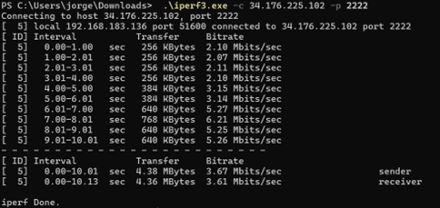

### Resultado de la prueba

- **Ancho de banda**:
  - Receiver: 3.61 Mbps.
  - Sender: 3.67 Mbps.
- **Duración**: 10 segundos.
- No se observaron pérdidas de paquetes.

Comparado con las pruebas locales, se observa una diferencia significativa en el rendimiento, reflejando las limitaciones impuestas por un entorno externo a la red local.

---

# Referencias

- Stallings, W. (2004). _Comunicaciones y Redes de Computadores. Séptima edición_. Pearson.
- [iperf3 documentation](https://iperf.fr/iperf-doc.php).
