# Trabajo Práctico N° 3

### Nombres _(por órden alfabético)_
_Gil Cernich Manuel (manuel.gil.cernich@mi.unc.edu.ar)_  
_González Damián M. (damian.gonzalez@mi.unc.edu.ar)_  
_Zuñiga Ivan A. (ivan.zuniga@mi.unc.edu.ar)_

### Nombre del grupo  
_epsilon_  

### Nombre del centro educativo

_Facultad de Ciencias Exactas, Físicas y Naturales; Universidad Nacional de Córdoba_

### Nombre del curso

_Redes de Computadoras_

### Profesores _(por órden alfabético)_

_Henn Santiago M._  
_Oliva Cuneo Facundo_

### Fecha

_24-04-2025_

---

# Resumen

Este trabajo está enfocado en el **enrutamiento dinámico**, cual es una de las dos opciones disponibles (siendo la otra _entrutamiento estático_) para realizar enrutamiento a la hora de transferir datos de un host a otro. Todo lo que ronda al enrutamiento, trabaja en la capa 3 del modelo OSI: Capa de Red. Los dispositivos de red que trabajan en la mencionada capa son los **routers**. Dentro de lo que es el enrutamiento dinámico, existen un puñado de protocolos opciones. Uno de ellos es **OSPF**, cual sería el más utilizado actualmente, y sobre el cual se hará foco aquí.

**Palabras clave**: _Capa 3 OSI, capa de red, enrutamiento, enrutamiento dinámico, OSPF._

# Introducción

El trabajo está dividido en 11 items guía, planteados en la consigna. Se utilizó Cisco Packet Tracer para la simulación de las diversas partes prácticas.

# Desarrollo

## 1)

### OSPF & Dijsktra

OSPF refiere a **O**pen **S**hortest **P**ath **F**irst. Es un protocolo de capa 3 del modelo OSI: Capa de Red. Fuerza by-passear la capa 4 del modelo OSI, es decir que en un datagrama enviado, no hay información de capa 4 (TCP o UDP en suite TCP/IP). Este es un protocolo en el que hablan los **routers**.  

El objetivo de la implementación/uso de este protocolo, es lograr tener una **tabla de enrutamiento** por router, de modo tal que cuando un host quiera enviar datos a otro host, que está fuera de la subred local, el router pueda decidir a que próximo gateway (otro router) pasarle el datagrama para que siga circulando hacia su destino, **de modo eficiente**.

Internamente utiliza el algoritmo de **Dijkstra** para calcular la ruta más corta entre el host origen, y el host destino. La medida métrica se denomina **costo**, y se calcula automáticamente teniendo en cuenta parámetros como:

- Ancho de banda.
- MTU.

Si no se desea utilizar el cálculo automático del **costo**, este se puede establecer manualmente en routers Cisco (al menos en ellos).

Los routers intercambian **paquetes OSPF** para tener sus **tablas de enrutamiento** actualizadas. Luego cada uno de ellos aplica el algoritmo del "camino mas corto", también conocido como **Dijkstra**, quien fué el creador del algoritmo, para definir cual es el mejor _próximo salto_ del datagrma, es decir, a que próximo nodo dirigir el datagrama. Este algoritmo hace uso del **costo** de cada nodo de la red para calular el _camino mas corto_, o en realidad, el "menos costoso" en relación a tiempo y ocupación de recursos.

### Tipos de redes

Una forma de caracterizar tipos de redes, es por su **clase**: A, B o C. Se refieren a categorías de direcciones IP según el tamaño de la red.  

- **Clase A**: Redes grandes (1.0.0.0 - 127.255.255.255).
- **Clase B**: Redes medianas (128.0.0.0 - 191.255.255.255).
- **Clase C**: Redes pequeñas (192.0.0.0 - 223.255.255.255).

Cada clase tiene un rango específico de direcciones y se usa para organizar y asignar redes de acuerdo con su tamaño.

## 2)

### Esquema de red

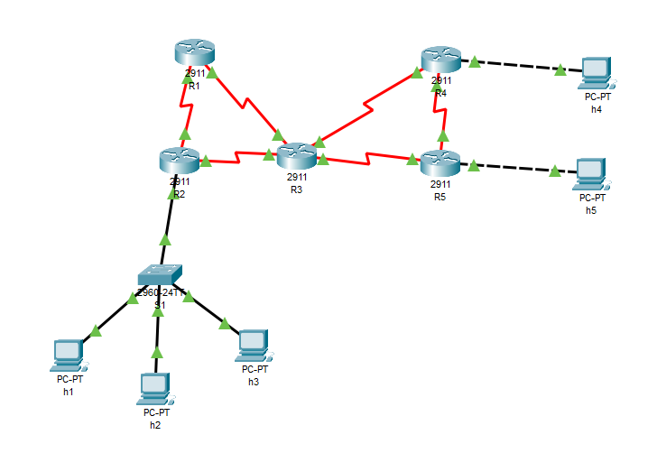

### Tabla de direccionamiento

| Dispositivo | Interfaz  | Dirección IP   | Máscara         | Red/Subred        | Descripción        |
|:------------|-----------|----------------|-----------------|-------------------|--------------------|
| h1          | Fa0       | 172.16.10.1    | 255.255.255.0   | 172.16.10.0/24    | Host en LAN1       |
| h2          | Fa0       | 172.16.10.2    | 255.255.255.0   | 172.16.10.0/24    | Host en LAN1       |
| h3          | Fa0       | 172.16.10.3    | 255.255.255.0   | 172.16.10.0/24    | Host en LAN1       |
| R2          | G0/0      | 172.16.10.254  | 255.255.255.0   | 172.16.10.0/24    | Gateway LAN1       |
| h4          | Fa0       | 172.16.40.2    | 255.255.255.0   | 172.16.40.0/24    | Host en LAN2       |
| R4          | G0/0      | 172.16.40.1    | 255.255.255.0   | 172.16.40.0/24    | Gateway LAN2       |
| h5          | Fa0       | 172.16.50.2    | 255.255.255.0   | 172.16.50.0/24    | Host en LAN3       |
| R5          | G0/0      | 172.16.50.1    | 255.255.255.0   | 172.16.50.0/24    | Gateway LAN3       |
| R1          | S0/3/0    | 192.168.100.1  | 255.255.255.252 | 192.168.100.0/30  | Enlace R1 ↔ R2     |
| R2          | S0/3/1    | 192.168.100.2  | 255.255.255.252 | 192.168.100.0/30  | Enlace R1 ↔ R2     |
| R2          | S0/3/0    | 192.168.100.5  | 255.255.255.252 | 192.168.100.4/30  | Enlace R2 ↔ R3     |
| R3          | S0/3/0    | 192.168.100.6  | 255.255.255.252 | 192.168.100.4/30  | Enlace R2 ↔ R3     |
| R1          | S0/3/1    | 192.168.100.9  | 255.255.255.252 | 192.168.100.8/30  | Enlace R1 ↔ R3     |
| R3          | S0/3/1    | 192.168.100.10 | 255.255.255.252 | 192.168.100.8/30  | Enlace R1 ↔ R3     |
| R3          | S0/2/0    | 192.168.100.13 | 255.255.255.252 | 192.168.100.12/30 | Enlace R3 ↔ R4     |
| R4          | S0/3/0    | 192.168.100.14 | 255.255.255.252 | 192.168.100.12/30 | Enlace R3 ↔ R4     |
| R3          | S0/2/1    | 192.168.100.17 | 255.255.255.252 | 192.168.100.16/30 | Enlace R3 ↔ R5     |
| R5          | S0/3/1    | 192.168.100.18 | 255.255.255.252 | 192.168.100.16/30 | Enlace R3 ↔ R5     |
| R4          | S0/3/1    | 192.168.100.21 | 255.255.255.252 | 192.168.100.20/30 | Enlace R4 ↔ R5     |
| R5          | S0/3/0    | 192.168.100.22 | 255.255.255.252 | 192.168.100.20/30 | Enlace R4 ↔ R5     |
| R1          | Loopback0 | 1.1.1.1        | 255.255.255.255 | -                 | Loopback Router ID |

## 3)

_NOTA: Aquí también se realizó el punto 5)a)._

### Configuración R1

```text
enable
configure terminal
router ospf 1
network 192.168.100.0 0.0.0.3 area 0
network 192.168.100.8 0.0.0.3 area 0
network 1.1.1.1 0.0.0.0 area 0
```

### Configuración R2

```text
enable
configure terminal
router ospf 1
network 172.16.10.0 0.0.0.255 area 0
network 192.168.100.0 0.0.0.3 area 0
network 192.168.100.4 0.0.0.3 area 0
```

### Configuración R3

```text
enable
configure terminal
router ospf 1
network 192.168.100.4 0.0.0.3 area 0
network 192.168.100.8 0.0.0.3 area 0
network 192.168.100.12 0.0.0.3 area 0
network 192.168.100.16 0.0.0.3 area 0
```

### Configuración R4

```text
enable
configure terminal
router ospf 1
network 172.16.40.0 0.0.0.255 area 0
network 192.168.100.12 0.0.0.3 area 0
network 192.168.100.20 0.0.0.3 area 0
```

### Configuración R5

```text
enable
configure terminal
router ospf 1
network 172.16.50.0 0.0.0.255 area 0
network 192.168.100.20 0.0.0.3 area 0
network 192.168.100.16 0.0.0.3 area 0
```

### Verificación de la conexión, punto a punto entre nodos

Se utilizó el comando: `ping <dirección_IP_del_router_vecino>`.  

Esto permitió comprobar que cada router puede comunicarse correctamente con sus vecinos directos a través de los enlaces punto a punto configurados mediante OSPF.

#### Ping R1 a R2, y R1 a R3

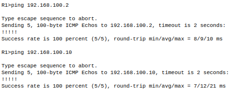

#### Ping R2 a R1, y R2 a R3

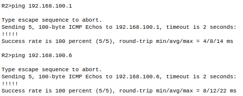

#### Ping R3 a R2, R3 a R1, R3 a R4, y R3 a R5

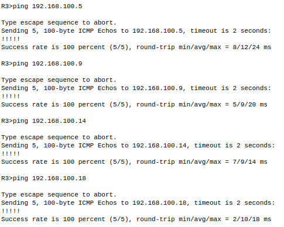

### Tablas de enrutamiento OSPF

La letra "O" representa que la ruta fue aprendida mediante OSPF.

Se utilizó el comando: `show ip route ospf`, que permite verificar que cada router recibe rutas dinámicamente mediante OSPF.

#### Tabla de enrutamiento OSPF en R1

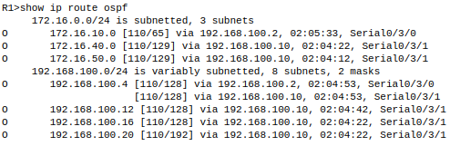

#### Tabla de enrutamiento OSPF en R2

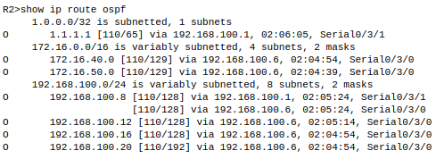

#### Tabla de enrutamiento OSPF en R3

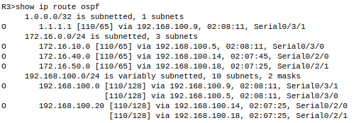

#### Tabla de enrutamiento OSPF en R4

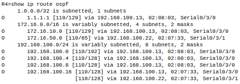

#### Tabla de enrutamiento OSPF en R5

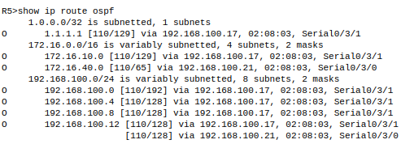

## 4)

### HELLO

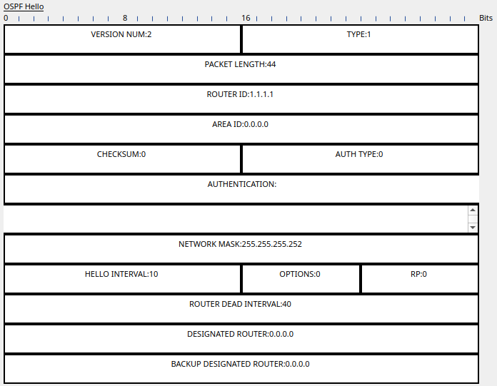

- Este es el primer mensaje que se intercambia entre routers.
- Su función es descubrir y mantener vecinos OSPF.
- Contiene el ID del router, máscara de red, intervalos de HELLO y DEAD, y campos para DR/BDR.  

**Impacto**: permite que los routers identifiquen interfaces compatibles y formen relaciones de vecindad; esencial para iniciar el proceso de enrutamiento.

### DD (Database Description)

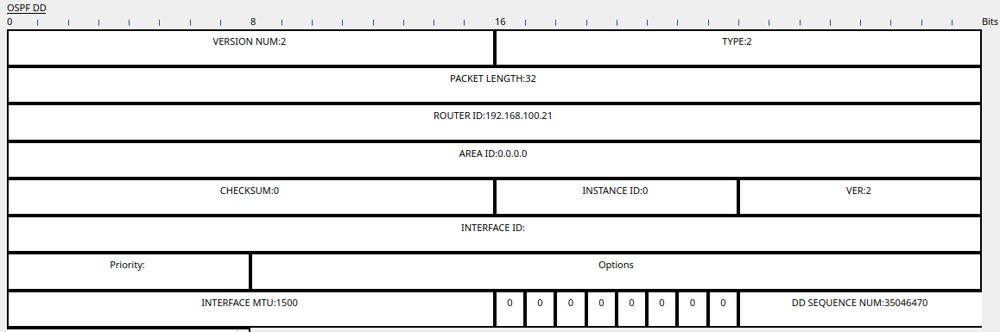

- Este paquete contiene un resumen de las LSAs (Link-State Advertisement) conocidas por el router.
- Se utiliza para comparar bases de datos entre routers vecinos.  

**Impacto**: es el paso previo al intercambio completo de información de red. Optimiza el proceso al evitar redundancia.

### LSR (Link-State Request)

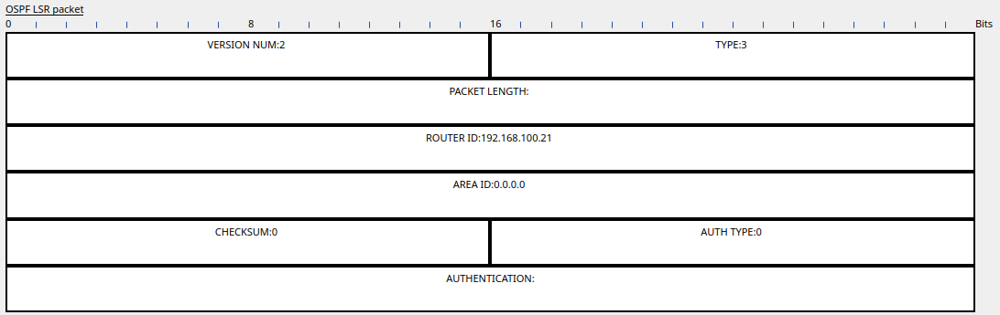

- Si un router detecta que le falta información, tras recibir un DD, solicita detalles específicos con un LSR.

**Impacto**: asegura que cada router posea una visión completa y precisa del estado de la red.

### LSU (Link-State Update)

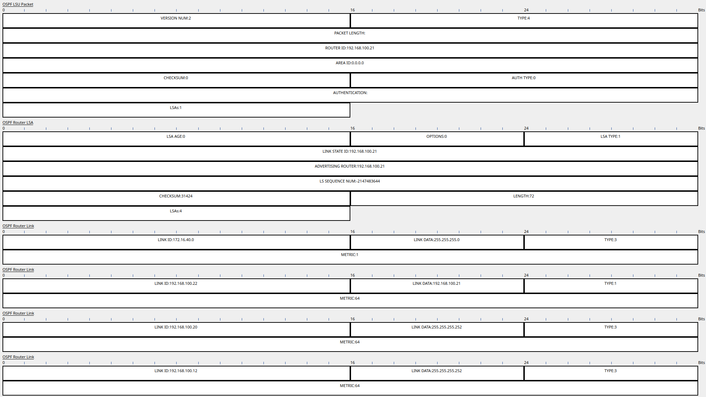

- Este paquete contiene las LSAs completas que fueron solicitadas mediante LSR.
- Incluye identificadores de enlaces, métricas y tipos de red.  

**Impacto**: constituye el núcleo del intercambio de rutas OSPF. Es el mensaje que realmente actualiza la base de datos del router.

### LSAck (Link-State Acknowledgment)

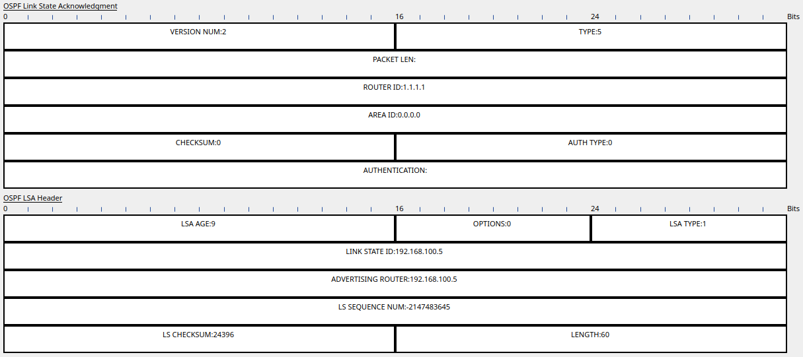

- Después de recibir un LSU, el router responde con una confirmación (LSAck).
- Solo incluye encabezados de LSAs para indicar que fueron recibidas correctamente.

**Impacto**: proporciona confiabilidad al protocolo, evitando pérdidas de información.

## 5)

_NOTA: El punto 5)a) es realizó conjuntamente al punto 3). Ver mas arriba._

### Lectura de entradas en la LSDB de cada router

#### R1

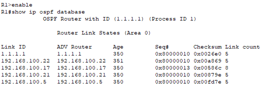

#### R2

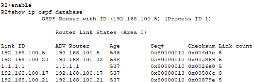

#### R3

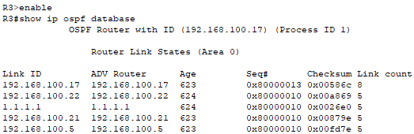

#### R4

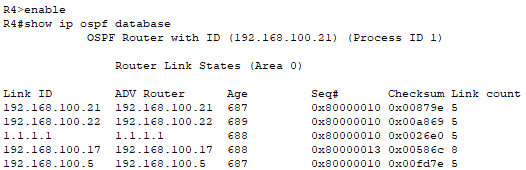

#### R5


## 6)

_NOTA: No puede existir tal cosa como área "A" o "B"; el valor esperado en ese parámetro es numérico, por lo que se usará 0 y 1 respectivamente. Los routers R1 y R2 ya están configurados correctamente en area 0._

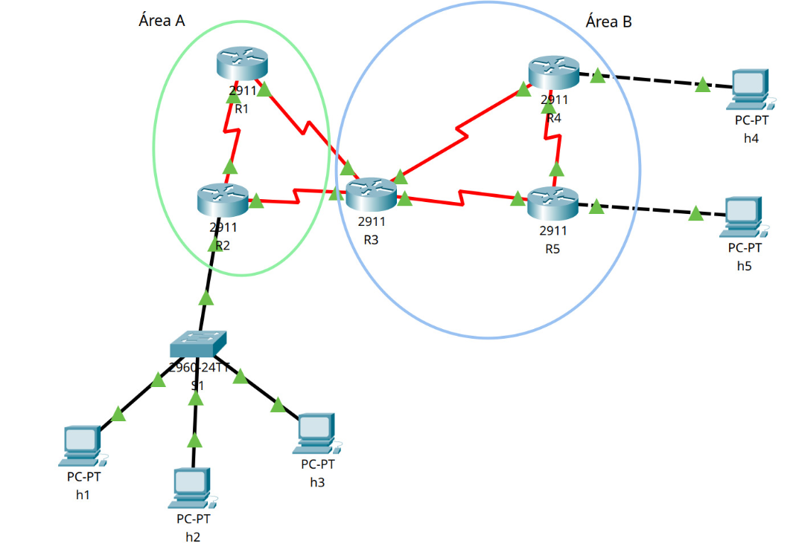

### Configuración R3

```text
enable
configure terminal
router ospf 1
network 192.168.100.4 0.0.0.3 area 0
network 192.168.100.8 0.0.0.3 area 0
network 192.168.100.12 0.0.0.3 area 1
network 192.168.100.16 0.0.0.3 area 1
```

### Configuración R4

```text
enable
configure terminal
router ospf 1
network 172.16.40.0 0.0.0.255 area 1
network 192.168.100.12 0.0.0.3 area 1
network 192.168.100.20 0.0.0.3 area 1
```

### Configuración R5

```text
enable
configure terminal
router ospf 1
network 172.16.50.0 0.0.0.255 area 1
network 192.168.100.20 0.0.0.3 area 1
network 192.168.100.16 0.0.0.3 area 1
```

### Lectura de entradas en la LSDB de cada router

#### R1

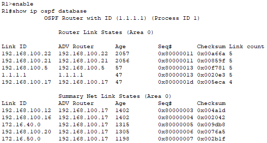

#### R2

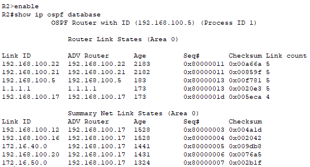

#### R3

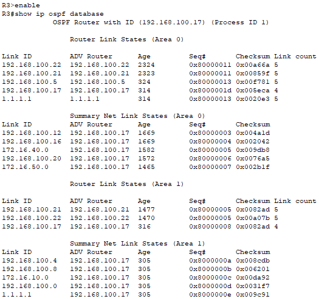

#### R4

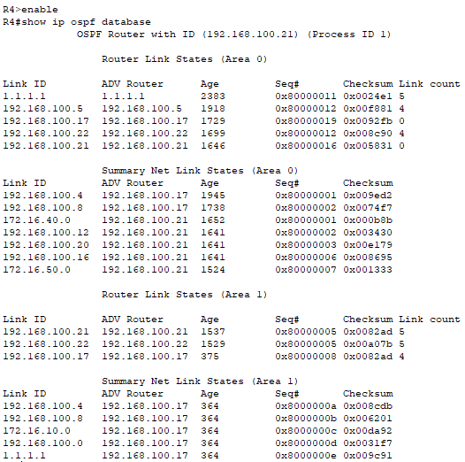

#### R5

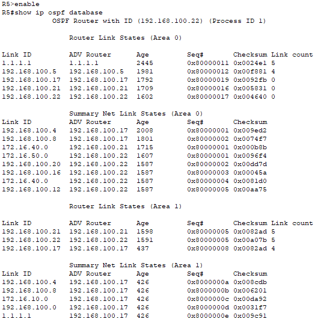

---

## 7)

### a)

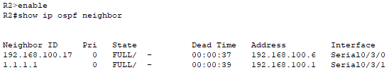

### b)

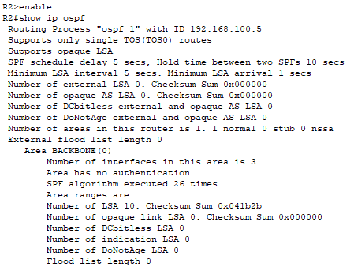
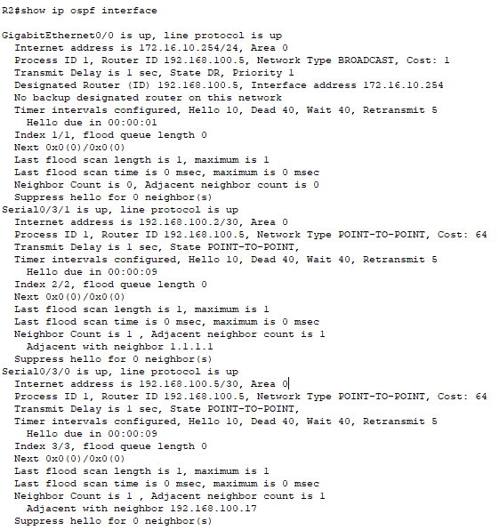

## 8)

En este item, lo que se hará es modificar manualmente el **costo** de la _rama_ que va desde R3 a R4 directamente, de modo que antes a esta modificación, un paquete que _desea_ viajar desde **h1** hacia **h4**, tome el camino: h1 -> S1 -> R2 -> R3 -> R4 -> h4; y después de la modificación tome el camino: h1 -> S1 -> R2 -> R3 -> R5 -> R4 -> h4.  

La siguiente es una captura de `tracert` desde **h1** hacia **h4**, previa a cualquier modificación. Como se puede observar, las marcas de tiempo corresponden respectivamente a h1 -> R3 -> R4 -> h4:

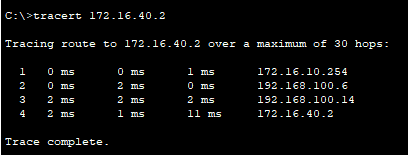

Luego se procede a realizar la modificación de costo en R3 -> R4:

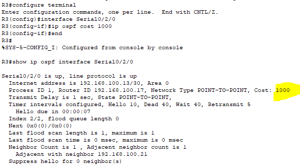

Como se pudo observar en la imagen previa, se establece el costo de esa _rama_ en 1000, un número mucho mayor al que OSPF asigna automáticamente de acuerdo al ancho de banda de cada rama, que al utilizar elementos estándar en Cisco Packet Tracer, no supera el valor 100 (dependiendo qué rama, oscila entre 1~64). La espectativa es entonces esperar R3 -> R5 -> R4 en el siguiente `tracert`:

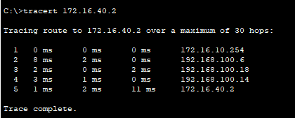

**Efectivamente ello sucede**. _Luego de este item, re-establecimos las configuraciones a las que teníamos hasta el punto 5, para hacer los siguientes items._

## 9)

Parte de estos pasos ya se realizó en el item 2), cuando se hizo el esquema de red en Cisco Packet Tracer.

Se hayó que _CiscoOS_ no te permite establecer como ruta estática predeterminada una dirección de loopback, y si se utiliza una ficticia, no funciona el paso c), es decir, no queda impactada la idea en la _red OSPF_.

La solución hayada fué establecer como ruta estática predeterminada la dirección IP de alguna NIC (input) siguiente a una NIC cualquiera de salida de R1:

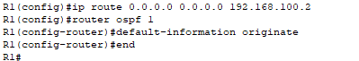

Como se pudo observar en los 2 comandos _del medio_, allí se implica _dejar asentado_ en R1 que él tiene _salida a la internet_, información que será utilizada por todos los routers del esquema si no logran ubicar adonde mandar el paquete, ergo se manda a la interfaz seleccionada como "por defecto".  

Aquí se puede comprobar desde R3, que _ya le llegó_ esta información:

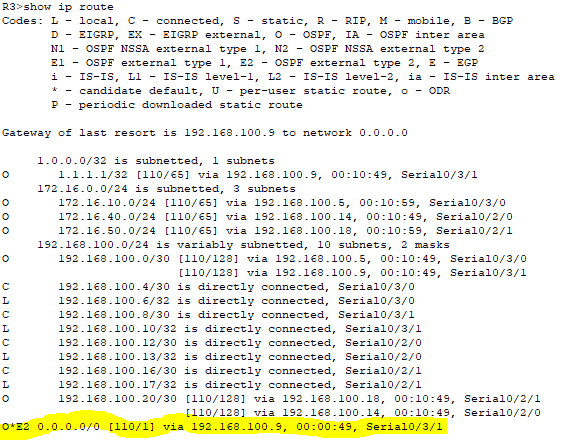

## 10)

En OSPF, cada router construye su LSDB (Link-State Database), que es esencialmente su "mapa" detallado de la topología de red dentro de su área. Este mapa se arma con la información que llega en los LSAs (Link-State Advertisements). Estos LSAs son como mensajes que los routers generan para describir su estado y conexiones.

Para que todos los routers compartan esta información y construyan el mismo mapa, utilizan un mecanismo llamado inundación (flooding): cuando un router genera o recibe un LSA nuevo o actualizado, lo envía a sus vecinos OSPF. Estos vecinos, a su vez, lo guardan y lo reenvían a sus otros vecinos (excepto por donde llegó). Este proceso se repite, asegurando que el LSA "inunde" y se propague rápidamente por toda la zona designada (como un área OSPF), distribuyendo así la información.

Existen diferentes tipos de LSAs, cada uno especializado en describir una parte distinta de la topología. A continuación, se detallarán algunas de ellas:

- **LSA Tipo 1 (Router LSA):**  
  Lo genera cada router para describirse a sí mismo y sus conexiones directas (sus enlaces o interfaces) dentro de su propia área.  
  Es la información básica de "quién soy y a qué estoy conectado localmente".

- **LSA Tipo 2 (Network LSA):**  
  Lo genera el Router Designado (DR) en redes compartidas (como Ethernet) para describir qué routers están conectados a esa misma red dentro del área.  
  Ayuda a mapear esas redes multiacceso.

- **LSA Tipo 3 (Summary LSA):**  
  Lo generan los ABRs (Area Border Routers) para anunciar las redes de un área hacia otras áreas.  
  Permiten la comunicación entre diferentes zonas del OSPF.

Estos distintos tipos de LSAs, cada uno con su función y alcance, son las piezas que, juntas, forman la LSDB completa en cada router, permitiéndole tener una visión detallada tanto de su propia área como de la conectividad hacia otras áreas y redes externas.

El objetivo final sigue siendo que todos los routers en un área tengan la misma LSDB.

Cuando ocurre un fallo (como la caída de una interfaz), los routers afectados envían LSAs actualizados (del tipo correspondiente al cambio), lo que modifica las LSDBs de los demás routers y los obliga a recalcular sus rutas (vía SPF) basándose en el mapa actualizado.

Esto es lo que veremos en detalle a continuación para cada escenario de fallo.

## Caída de la Interfaz R2 - R1:

### Impacto Inmediato:
La adyacencia OSPF entre R1 y R2 se cae. Ya no intercambian Hellos ni LSAs por ese enlace directo.

### Cambios en LSAs y LSDB:

#### Área A:
- R1 actualiza su LSA de Tipo 1, eliminando el enlace a R2. Mantiene el enlace a R3 (que cruza al área B). Realiza un flooding de este LSA actualizado en el área A.
- R2 actualiza su LSA de Tipo 1, eliminando el enlace a R1. Mantiene los enlaces a R3 (inter-área) y a S1 (intra-área). Realiza un flooding de este LSA actualizado en el área A.
- Las LSDBs de R1 y R2 (para el área A) se actualizan para reflejar la pérdida del enlace directo R1-R2.

#### Área B:
- No hay cambios directos en los LSAs de Tipo 1 o Tipo 2 dentro del área B originados por R3, R4 o R5 debido a esta falla específica.
- Los LSAs de Tipo 3 generados por los ABRs (R2 y R3) podrían recalcularse si el costo o la ruta preferida hacia alguna red en el área A cambia. R3 todavía tiene conexión directa tanto a R1 como a R2 (por enlaces separados).

### Impacto en el Enrutamiento:

- **R1**: Pierde la ruta directa a R2. No queda aislado. Sigue conectado a R3. Recalcula sus rutas (mediante SPF) y ahora alcanzará a R2 y a la LAN de S1 a través de R3 (`R1 -> R3 -> R2`). Mantiene conectividad con el área B directamente vía R3.
- **R2**: Pierde la ruta directa a R1. Recalcula sus rutas y ahora alcanzará R1 a través de R3 (`R2 -> R3 -> R1`). Mantiene conectividad con S1 (local) y con el área B directamente vía R3.
- **R3, R4, R5**: Recalculan sus rutas. Pueden experimentar un cambio en el costo o la ruta preferida para llegar a R1 o R2, pero la conectividad general se mantiene intacta ya que R3 sigue conectado a ambos (R1 y R2) y al resto del área B.

## Caída de la Interfaz R2 - R3:

### Impacto Inmediato:
La adyacencia OSPF entre R2 y R3 se cae.

### Cambios en LSAs y LSDB:

#### Área A:
- R2 actualiza su LSA de Tipo 1, eliminando el enlace a R3. Mantiene los enlaces a R1 y S1. Realiza un flooding en el Área A.
- Como ABR, R2 dejará de actualizar LSAs de Tipo 3 hacia el área A que describan las redes del área B, aprendidas únicamente a través de R3. Sin embargo, R1 (conectado a R3) todavía puede recibir información del área B vía R3.
- LSDBs en el área A (R1, R2) se actualizan.

#### Área B:
- R3 actualiza su LSA de Tipo 1, eliminando el enlace a R2. Mantiene los enlaces a R1, R4 y R5. Realizar un flooding en el área B.
- Como ABR, R3 dejará de actualizar LSAs de Tipo 3 hacia el área B que describan redes del área A aprendidas únicamente a través de R2 (como S1). Aún puede anunciar redes del área A aprendidas vía R1.
- LSDBs en Área B (R3, R4, R5) se actualizan.

### Impacto en el Enrutamiento:

- **R1, R2**: Pierden la ruta hacia el área B a través de R2. R1 aún puede alcanzar el área B directamente vía R3. R2 ahora debe enrutar hacia el área B a través de R1 (`R2 -> R1 -> R3 -> Área B`). La conectividad se mantiene pero la ruta para R2 cambia.
- **R3, R4, R5**: Pierden la ruta hacia S1 (y hacia R2) a través del enlace directo R3-R2. Aún pueden alcanzar R1 directamente vía R3. Para alcanzar R2 y S1, ahora deben usar la ruta `R3 -> R1 -> R2`. La conectividad se mantiene pero la ruta cambia.

## Caída de la Interfaz R2 - S1:

### Impacto Inmediato:
R2 pierde conectividad con S1 (h1, h2, h3).

### Cambios en LSAs y LSDB:

#### Área A:
- R2 actualiza su LSA de Tipo 1, eliminando la información del enlace/red hacia S1. Mantiene enlaces a R1 y R3. Realiza un flooding en el área A.
- Si existía un LSA de Tipo 2 para ese segmento, deja de generarse o expira.
- Las LSDBs de R1 y R2 se actualizan, eliminando la red de S1 de la topología intra-área conocida.

#### Área B:
- R2 (como ABR) dejará de generar el LSA de Tipo 3 que anunciaba la red de S1 hacia el Área B (porque ya no la conoce intra-área).
- R3 (como ABR) también dejará de anunciar la red de S1 hacia el Área B (ya que tampoco la aprenderá de R2 o R1).
- Las LSDBs en R3, R4, R5 eventualmente eliminarán la entrada del LSA Tipo 3 correspondiente a la red de S1.

### Impacto en el Enrutamiento:

- **R1, R2**: Pierden la ruta hacia la red de S1 (h1, h2, h3). Mantienen plena conectividad entre sí (vía R1-R2 y/o R1-R3-R2) y con toda el Área B (vía R1-R3 y/o R2-R3).
- **R3, R4, R5**: Pierden la ruta hacia la red de S1. Mantienen plena conectividad con R1, R2 y dentro del Área B.

## 11)

La RIB (Routing Information Base) y la FIB (Forwarding Information Base),ambas contienen rutas de red, pero no son lo mismo. A continuación, se presentará un análisis de cada una.

### RIB: Routing Information Base

- Es la tabla maestra de rutas del router.
- Contiene todas las rutas conocidas, sean activas, inactivas o alternativas.
- Se alimenta de:
  - Protocolos de enrutamiento.
  - Rutas estáticas configuradas por el administrador.
  - Rutas directamente conectadas.
- Se construye en el plano de control.
- Puede contener múltiples rutas hacia un mismo destino.
- Se consulta con `show ip route`.

### FIB: Forwarding Information Base

- Tabla optimizada para reenviar paquetes rápidamente.
- Contiene solo las mejores rutas activas seleccionadas a partir de la RIB.
- Está diseñada para búsquedas rápidas.
- Opera en el plano de datos, usa la FIB previamente construída.
- Incluye información de reescritura de capa 2, como direcciones MAC y datos de encapsulamiento.
- En routers Cisco, puede visualizarse mediante el comando: `show ip cef`.

### Justificación basada en la práctica.

> **Nota sobre Packet Tracer**: El comando `show ip cef`, utilizado para visualizar la FIB en routers Cisco reales, no está disponible en Packet Tracer, ya que CEF no está completamente implementado en este entorno de simulación.  
> A pesar de esta limitación, es posible inferir el funcionamiento de la FIB observando las rutas activas en la RIB mediante el comando `show ip route`.

En la siguiente imagen, mostrada anteriormente, se presenta la tabla de rutas (`RIB`) del router R3:


- Las líneas que comienzan con `O` indican rutas aprendidas por OSPF y sus métricas están entre corchetes (`[110/x]`), donde `110` es la distancia administrativa (AD).
- Se visualizan múltiples rutas a diferentes destinos, incluyendo:
  - Rutas internas (`C`), conectadas directamente.
  - Rutas locales (`L`), generadas automáticamente para cada dirección IP asignada a una interfaz del router.
  - Rutas dinámicas (`O`), aprendidas mediante OSPF.


Lo que vemos en esta tabla es la RIB, que contiene toda la información de enrutamiento conocida por el router, tanto activa como inactiva. Es la base de datos central que mantiene el plano de control. A partir de ella se seleccionan las mejores rutas para cada destino.

Por otro lado, la FIB, que no es visible directamente en Packet Tracer, contiene únicamente las rutas activas seleccionadas de la RIB, formateadas para permitir decisiones de reenvío rápidas por el plano de datos.

Una forma de inferir qué está en la FIB es observar qué rutas en la RIB tienen un asterisco `*`, estas son las rutas activas. Por ejemplo, la entrada:

```
O*E2 0.0.0.0/0 [110/1] via 192.168.100.9, Serial0/3/1
```
La misma indica que se trata de una ruta por defecto aprendida por OSPF externo (tipo E2), utilizada como ruta activa para reenviar cualquier tráfico sin coincidencia más específica. Al estar marcada con `*`, forma parte de la FIB y se usa para enviar paquetes a través de `Serial0/3/1` hacia `192.168.100.9`.

# Conclusiones

OSPF es actualmente dentro de los protocolos del género al que pertenece, el mas utilizado. Su algoritmo que mide el ancho de banda de cada _rama_ y genera costos para cada una de ellas, y la capacidad de compartir esta información _aguas abajo y arriba_ dentro del lugar que ocupa en la red, lo hacen una excelente idea para calcular el camino _menos costoso_.

# Referencias

- Stallings, W. (2004). _Comunicaciones y Redes de Computadores. Séptima edición_. Pearson.
- Autores varios. _[Open Shortest Path First](https://es.wikipedia.org/wiki/Open_Shortest_Path_First)_. Wikipedia.
- Autores varios. [OSPF Area Types and Accepted LSAs](https://www.juniper.net/documentation/us/en/software/junos/ospf/topics/topic-map/configuring-ospf-areas.html#id-understanding-ospf-areas__d34608e148). Juniper.
- Autores varios. [Configuring OSPF Areas](https://www.juniper.net/documentation/us/en/software/junos/ospf/topics/topic-map/configuring-ospf-areas.html#id-understanding-ospf-stub-areas-totally-stubby-areas-and-not-so-stubby-areas?ref=packetcoders.io). Juniper.
