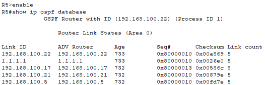

# Trabajo Práctico N° 3

### Nombres _(por órden alfabético)_
_Gil Cernich Manuel (manuel.gil.cernich@mi.unc.edu.ar)_  
_González Damián M. (damian.gonzalez@mi.unc.edu.ar)_  
_Zuñiga Ivan A. (ivan.zuniga@mi.unc.edu.ar)_

### Nombre del grupo  
_epsilon_  

### Nombre del centro educativo

_Facultad de Ciencias Exactas, Físicas y Naturales; Universidad Nacional de Córdoba_

### Nombre del curso

_Redes de Computadoras_

### Profesores _(por órden alfabético)_

_Henn Santiago M._  
_Oliva Cuneo Facundo_

### Fecha

_24-04-2025_

---

# Resumen

Este trabajo está enfocado en el **enrutamiento dinámico**, cual es una de las dos opciones disponibles (siendo la otra _entrutamiento estático_) para realizar enrutamiento a la hora de transferir datos de un host a otro. Todo lo que ronda al enrutamiento, trabaja en la capa 3 del modelo OSI: Capa de Red. Los dispositivos de red que trabajan en la mencionada capa son los **routers**. Dentro de lo que es el enrutamiento dinámico, existen un puñado de protocolos opciones. Uno de ellos es **OSPF**, cual sería el más utilizado actualmente, y sobre el cual se hará foco aquí.

**Palabras clave**: _Capa 3 OSI, capa de red, enrutamiento, enrutamiento dinámico, OSPF._

---

# Introducción

El trabajo está dividido en 11 items guía, planteados en la consigna. Se utilizó Cisco Packet Tracer para la simulación de las diversas partes prácticas.

---

# Desarrollo

## 1)

### OSPF & Dijsktra

OSPF refiere a **O**pen **S**hortest **P**ath **F**irst. Es un protocolo de capa 3 del modelo OSI: Capa de Red. Fuerza by-passear la capa 4 del modelo OSI, es decir que en un datagrama enviado, no hay información de capa 4 (TCP o UDP en suite TCP/IP). Este es un protocolo en el que hablan los **routers**.  

El objetivo de la implementación/uso de este protocolo, es lograr tener una **tabla de enrutamiento** por router, de modo tal que cuando un host quiera enviar datos a otro host, que está fuera de la subred local, el router pueda decidir a que próximo gateway (otro router) pasarle el datagrama para que siga circulando hacia su destino, **de modo eficiente**.

Internamente utiliza el algoritmo de **Dijkstra** para calcular la ruta más corta entre el host origen, y el host destino. La medida métrica se denomina **costo**, y se calcula automáticamente teniendo en cuenta parámetros como:

- Ancho de banda.
- MTU.

Si no se desea utilizar el cálculo automático del **costo**, este se puede establecer manualmente en routers Cisco (al menos en ellos).

Los routers intercambian **paquetes OSPF** para tener sus **tablas de enrutamiento** actualizadas. Luego cada uno de ellos aplica el algoritmo del "camino mas corto", también conocido como **Dijkstra**, quien fué el creador del algoritmo, para definir cual es el mejor _próximo salto_ del datagrma, es decir, a que próximo nodo dirigir el datagrama. Este algoritmo hace uso del **costo** de cada nodo de la red para calular el _camino mas corto_, o en realidad, el "menos costoso" en relación a tiempo y ocupación de recursos.

### Tipos de redes

Una forma de caracterizar tipos de redes, es por su **clase**: A, B o C. Se refieren a categorías de direcciones IP según el tamaño de la red.  

- **Clase A**: Redes grandes (1.0.0.0 - 127.255.255.255).
- **Clase B**: Redes medianas (128.0.0.0 - 191.255.255.255).
- **Clase C**: Redes pequeñas (192.0.0.0 - 223.255.255.255).

Cada clase tiene un rango específico de direcciones y se usa para organizar y asignar redes de acuerdo con su tamaño.

---

## 2)

### Esquema de red


### Tabla de direccionamiento

| Dispositivo | Interfaz  | Dirección IP   | Máscara         | Red/Subred        | Descripción        |
|:------------|-----------|----------------|-----------------|-------------------|--------------------|
| h1          | Fa0       | 172.16.10.1    | 255.255.255.0   | 172.16.10.0/24    | Host en LAN1       |
| h2          | Fa0       | 172.16.10.2    | 255.255.255.0   | 172.16.10.0/24    | Host en LAN1       |
| h3          | Fa0       | 172.16.10.3    | 255.255.255.0   | 172.16.10.0/24    | Host en LAN1       |
| R2          | G0/0      | 172.16.10.254  | 255.255.255.0   | 172.16.10.0/24    | Gateway LAN1       |
| h4          | Fa0       | 172.16.40.2    | 255.255.255.0   | 172.16.40.0/24    | Host en LAN2       |
| R4          | G0/0      | 172.16.40.1    | 255.255.255.0   | 172.16.40.0/24    | Gateway LAN2       |
| h5          | Fa0       | 172.16.50.2    | 255.255.255.0   | 172.16.50.0/24    | Host en LAN3       |
| R5          | G0/0      | 172.16.50.1    | 255.255.255.0   | 172.16.50.0/24    | Gateway LAN3       |
| R1          | S0/3/0    | 192.168.100.1  | 255.255.255.252 | 192.168.100.0/30  | Enlace R1 ↔ R2     |
| R2          | S0/3/1    | 192.168.100.2  | 255.255.255.252 | 192.168.100.0/30  | Enlace R1 ↔ R2     |
| R2          | S0/3/0    | 192.168.100.5  | 255.255.255.252 | 192.168.100.4/30  | Enlace R2 ↔ R3     |
| R3          | S0/3/0    | 192.168.100.6  | 255.255.255.252 | 192.168.100.4/30  | Enlace R2 ↔ R3     |
| R1          | S0/3/1    | 192.168.100.9  | 255.255.255.252 | 192.168.100.8/30  | Enlace R1 ↔ R3     |
| R3          | S0/3/1    | 192.168.100.10 | 255.255.255.252 | 192.168.100.8/30  | Enlace R1 ↔ R3     |
| R3          | S0/2/0    | 192.168.100.13 | 255.255.255.252 | 192.168.100.12/30 | Enlace R3 ↔ R4     |
| R4          | S0/3/0    | 192.168.100.14 | 255.255.255.252 | 192.168.100.12/30 | Enlace R3 ↔ R4     |
| R3          | S0/2/1    | 192.168.100.17 | 255.255.255.252 | 192.168.100.16/30 | Enlace R3 ↔ R5     |
| R5          | S0/3/1    | 192.168.100.18 | 255.255.255.252 | 192.168.100.16/30 | Enlace R3 ↔ R5     |
| R4          | S0/3/1    | 192.168.100.21 | 255.255.255.252 | 192.168.100.20/30 | Enlace R4 ↔ R5     |
| R5          | S0/3/0    | 192.168.100.22 | 255.255.255.252 | 192.168.100.20/30 | Enlace R4 ↔ R5     |
| R1          | Loopback0 | 1.1.1.1        | 255.255.255.255 | -                 | Loopback Router ID |

---

## 3)

_NOTA: Aquí también se realizó el punto 5)a)._

### Configuración R1

```text
enable
configure terminal
router ospf 1
network 192.168.100.0 0.0.0.3 area 0
network 192.168.100.8 0.0.0.3 area 0
network 1.1.1.1 0.0.0.0 area 0
```

### Configuración R2

```text
enable
configure terminal
router ospf 1
network 172.16.10.0 0.0.0.255 area 0
network 192.168.100.0 0.0.0.3 area 0
network 192.168.100.4 0.0.0.3 area 0
```

### Configuración R3

```text
enable
configure terminal
router ospf 1
network 192.168.100.4 0.0.0.3 area 0
network 192.168.100.8 0.0.0.3 area 0
network 192.168.100.12 0.0.0.3 area 0
network 192.168.100.16 0.0.0.3 area 0
```

### Configuración R4

```text
enable
configure terminal
router ospf 1
network 172.16.40.0 0.0.0.255 area 0
network 192.168.100.12 0.0.0.3 area 0
network 192.168.100.20 0.0.0.3 area 0
```

### Configuración R5

```text
enable
configure terminal
router ospf 1
network 172.16.50.0 0.0.0.255 area 0
network 192.168.100.20 0.0.0.3 area 0
network 192.168.100.16 0.0.0.3 area 0
```

### Verificación de la conexión, punto a punto entre nodos

Se utilizó el comando: `ping <dirección_IP_del_router_vecino>`.  

Esto permitió comprobar que cada router puede comunicarse correctamente con sus vecinos directos a través de los enlaces punto a punto configurados mediante OSPF.

#### Ping R1 a R2, y R1 a R3


#### Ping R2 a R1, y R2 a R3


#### Ping R3 a R2, R3 a R1, R3 a R4, y R3 a R5


### Tablas de enrutamiento OSPF

La letra "O" representa que la ruta fue aprendida mediante OSPF.

Se utilizó el comando: `show ip route ospf`, que permite verificar que cada router recibe rutas dinámicamente mediante OSPF.

#### Tabla de enrutamiento OSPF en R1


#### Tabla de enrutamiento OSPF en R2


#### Tabla de enrutamiento OSPF en R3


#### Tabla de enrutamiento OSPF en R4


#### Tabla de enrutamiento OSPF en R5


---

## 4)

### HELLO


- Este es el primer mensaje que se intercambia entre routers.
- Su función es descubrir y mantener vecinos OSPF.
- Contiene el ID del router, máscara de red, intervalos de HELLO y DEAD, y campos para DR/BDR.  

**Impacto**: permite que los routers identifiquen interfaces compatibles y formen relaciones de vecindad; esencial para iniciar el proceso de enrutamiento.

### DD (Database Description)


- Este paquete contiene un resumen de las LSAs (Link-State Advertisement) conocidas por el router.
- Se utiliza para comparar bases de datos entre routers vecinos.  

**Impacto**: es el paso previo al intercambio completo de información de red. Optimiza el proceso al evitar redundancia.

### LSR (Link-State Request)


- Si un router detecta que le falta información, tras recibir un DD, solicita detalles específicos con un LSR.

**Impacto**: asegura que cada router posea una visión completa y precisa del estado de la red.

### LSU (Link-State Update)


- Este paquete contiene las LSAs completas que fueron solicitadas mediante LSR.
- Incluye identificadores de enlaces, métricas y tipos de red.  

**Impacto**: constituye el núcleo del intercambio de rutas OSPF. Es el mensaje que realmente actualiza la base de datos del router.

### LSAck (Link-State Acknowledgment)


- Después de recibir un LSU, el router responde con una confirmación (LSAck).
- Solo incluye encabezados de LSAs para indicar que fueron recibidas correctamente.

**Impacto**: proporciona confiabilidad al protocolo, evitando pérdidas de información.

---

## 5)

_NOTA: El punto 5)a) es realizó conjuntamente al punto 3). Ver mas arriba._

### Lectura de entradas en la LSDB de cada router

#### R1


#### R2


#### R3


#### R4


#### R5



---

## 6)

_NOTA: No puede existir tal cosa como área "A" o "B"; el valor esperado en ese parámetro es numérico, por lo que se usará 0 y 1 respectivamente. Los routers R1 y R2 ya están configurados correctamente en area 0._

### Configuración R3

```text
enable
configure terminal
router ospf 1
network 192.168.100.4 0.0.0.3 area 0
network 192.168.100.8 0.0.0.3 area 0
network 192.168.100.12 0.0.0.3 area 1
network 192.168.100.16 0.0.0.3 area 1
```

### Configuración R4

```text
enable
configure terminal
router ospf 1
network 172.16.40.0 0.0.0.255 area 1
network 192.168.100.12 0.0.0.3 area 1
network 192.168.100.20 0.0.0.3 area 1
```

### Configuración R5

```text
enable
configure terminal
router ospf 1
network 172.16.50.0 0.0.0.255 area 1
network 192.168.100.20 0.0.0.3 area 1
network 192.168.100.16 0.0.0.3 area 1
```

### Lectura de entradas en la LSDB de cada router

#### R1


#### R2


#### R3


#### R4


#### R5


---

## 7)

### a)


### b)


---

## 8)


---

# Discusión y conclusiones

Lorem ipsum dolor sit amet, consectetur adipiscing elit. Sed tempor, mauris sit amet aliquet vestibulum, enim ante consectetur enim, vel sollicitudin odio risus vel libero. Integer eget ipsum sed eros luctus laoreet vel vel leo. Fusce ut dapibus nisl. Aliquam erat volutpat. Donec in elit non justo convallis vestibulum.

---

# Referencias

[1] Consultar [Normas APA](https://normas-apa.org/referencias/)  
[2] ...  
[3] ...  
