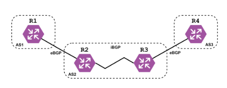
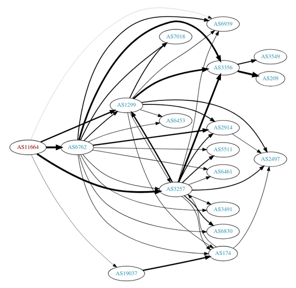
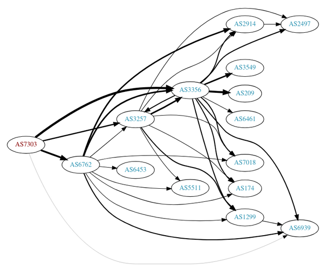
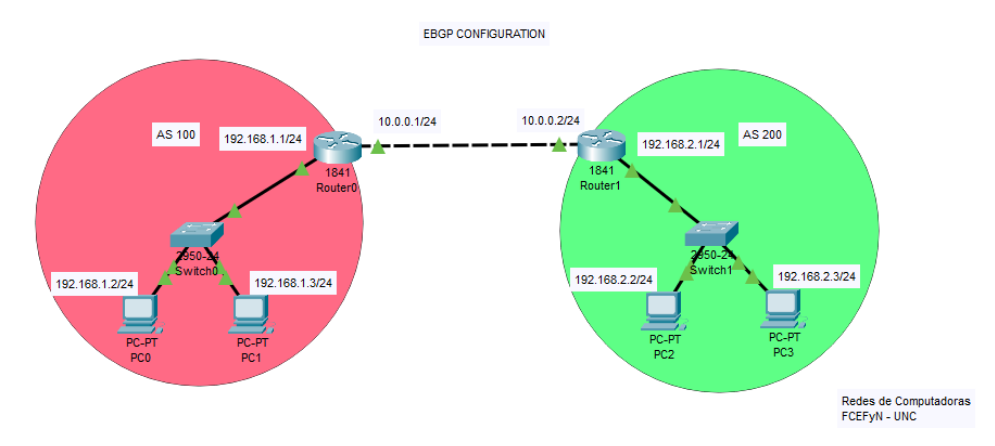
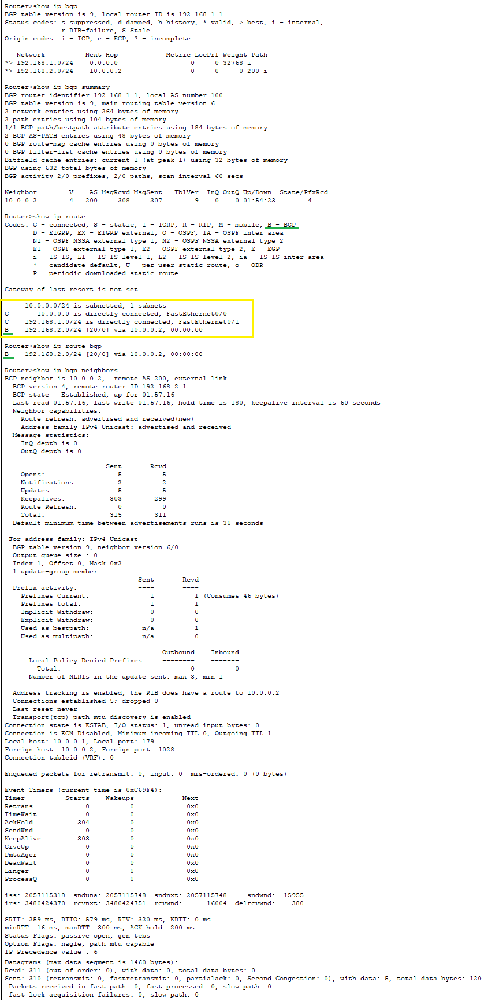
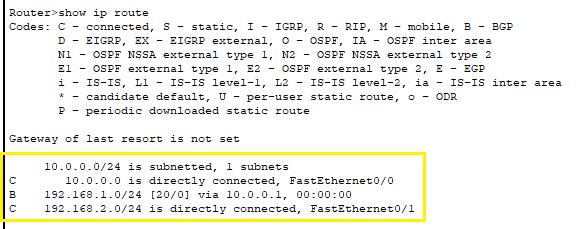
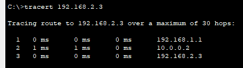
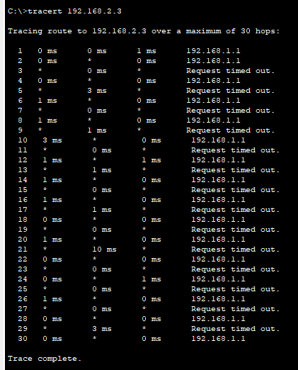

# Trabajo Práctico N° 4

### Nombres _(por órden alfabético)_
_Gil Cernich Manuel (manuel.gil.cernich@mi.unc.edu.ar)_  
_González Damián M. (damian.gonzalez@mi.unc.edu.ar)_  
_Zuñiga Ivan A. (ivan.zuniga@mi.unc.edu.ar)_

### Nombre del grupo
_epsilon_

### Nombre del centro educativo

_Facultad de Ciencias Exactas, Físicas y Naturales; Universidad Nacional de Córdoba_

### Nombre del curso

_Redes de Computadoras_

### Profesores _(por órden alfabético)_

_Henn Santiago M._  
_Oliva Cuneo Facundo_

### Fecha

_15-05-2025_

---

# Resumen

Este trabajo está centrado en el enrutamiento externo dinámico mediante el protocolo BGP (Border Gateway Protocol), una herramienta fundamental para el intercambio de información de ruteo entre Sistemas Autónomos (AS) en Internet. A diferencia del enrutamiento interno o del estático, BGP permite que redes administradas de forma independiente se comuniquen y mantengan rutas óptimas a través de un sistema descentralizado. Estos mecanismos operan en la capa 3 del modelo OSI y son implementados por routers que manejan grandes volúmenes de rutas. El enfoque principal de este trabajo es comprender los principios básicos de BGP, las diferencias entre iBGP y eBGP, y experimentar con configuraciones reales mediante simulaciones.

**Palabras clave**: _capa 3 OSI, enrutamiento externo, BGP, AS, ASN, ruteo dinámico._

---

# Introducción

El presente trabajo se organiza en dos grandes partes: una de investigación teórica e integración conceptual sobre Sistemas Autónomos y BGP, y otra dedicada a simulaciones y análisis prácticos utilizando Cisco Packet Tracer. A lo largo de los 11 ítems propuestos en la consigna, se abordan conceptos como la estructura de un ASN, las diferencias entre iBGP y eBGP, y se analizan conexiones reales mediante herramientas online. En la parte práctica, se implementa una topología con múltiples AS, se configuran routers con BGP y OSPF, se simula tráfico y se evalúan tablas de ruteo y conectividad IPv4/IPv6, incluyendo procesos de redistribución entre protocolos.

---

# Desarrollo

## Parte I - Integración de conceptos, actividades online e investigación

### Sistema Autónomo (AS)

Un Sistema Autónomo (AS) es un conjunto de redes interconectadas que operan bajo una misma administración y comparten una política de enrutamiento común. Puede considerarse como una gran red dentro de Internet, con sus propias reglas, operada por una organización de gran tamaño. Cada AS se encarga de gestionar su propio tráfico y decide cómo enrutar sus datos hacia otros AS. La comunicación entre distintos AS se realiza mediante routers de frontera, que intercambian información de rutas a través del protocolo BGP (Border Gateway Protocol).

### Autonomous System Number (ASN)

Un sistema autónomo tiene asignado un identificador único denominado Número de Sistema Autónomo (ASN), de 32 bits, que lo identifica de forma exclusiva en Internet. Este número es utilizado por BGP para diferenciar las rutas de un AS respecto de las de otros.

La autoridad IANA es la encargada de distribuir bloques de ASN a los Registros Regionales de Internet (RIR), quienes se encargan de asignar los ASN específicos a las organizaciones finales.

A continuación, se presentan tres ejemplos de ASN asignados a organizaciones reconocidas:

- Google LLC – AS15169
- Carnegie Mellon University – AS9
- CERN - European Organization for Nuclear Research – AS513

### Mi conexión actual y su ASN

En mi caso, mi conexión pertenece al ASN 11664, asignado a la empresa Claro Argentina (AMX Argentina S.A.). Se trata de un proveedor regional de servicios de Internet que opera principalmente en Argentina y Paraguay.

#### Información técnica del ASN 11664 – Claro Argentina:

- **Organización:** AMX Argentina S.A. (Claro)
- **Tipo de red:** ISP (Cable/DSL)
- **Cantidad de prefijos:**
    - IPv4: 3.000
    - IPv6: 600
- **Protocolos soportados:**
    - Unicast IPv4
    - Multicast
    - IPv6
- **Tráfico estimado:** Entre 1 y 5 Tbps
- **Ámbito geográfico:** Regional
- **Ratios de tráfico:** Mayor tráfico entrante (Heavy Inbound)
- **Participación en puntos de intercambio:**
    - AR-IX (Cabase – Argentina)
    - Interconexión con múltiples data centers en Buenos Aires y Asunción
- **Sitio web:** [www.claro.com.ar](http://www.claro.com.ar)

### Border Gateway Protocol (BGP)

El Border Gateway Protocol (BGP) es un protocolo de enrutamiento de gateway exterior (EGP), diseñado para intercambiar información de enrutamiento y alcanzabilidad entre distintos AS en el Internet. Permite la interconexión de redes independientes. Aunque influye directamente en las decisiones de enrutamiento a nivel de Capa 3 del modelo OSI (Red), BGP no opera directamente en esa capa.

Desde el punto de vista arquitectónico, BGP se implementa como una aplicación de red especializada que utiliza los servicios de la Capa 4 (Transporte) del modelo OSI, específicamente el protocolo TCP (puerto 179). Esto significa que la lógica de BGP se ejecuta en procesos independientes (BGP speakers) que establecen sesiones confiables punto a punto mediante TCP, delegando en él la fiabilidad, la segmentación y el control de flujo de los datos que intercambia.

En este sentido, BGP se comporta como una aplicación de la Capa 7 del modelo OSI, ya que:

- Define su propia máquina de estados (FSM) para el establecimiento, mantenimiento y terminación de sesiones.
- Gestiona su propio conjunto estructurado de mensajes (OPEN, UPDATE, KEEPALIVE, NOTIFICATION).
- Intercambia datos no de usuario, sino de control de enrutamiento (NLRI y atributos de ruta).
- Aplica políticas complejas para filtrar, preferir o descartar rutas, decisiones que no toman los protocolos de capas inferiores.

Esta clasificación es ampliamente aceptada y concuerda con lo descrito en el RFC 1812, que establece que BGP no participa directamente del plano de datos, sino que opera en el plano de control, influenciando las decisiones de encaminamiento a través de la gestión y distribución de información de rutas. Su diseño modular y su dependencia de TCP refuerzan su naturaleza de aplicación distribuida sobre la pila de protocolos, al igual que otros protocolos de la capa de aplicación como HTTP o SMTP.

Este protocolo, a su vez, clasifica como uno de vector de ruta (path-vector), que quiere decir que cada ruta incluye la secuencia de AS que debe atravesar para llegar al destino. Esto permite la prevención de bucles y facilita la aplicación de políticas de enrutamiento complejas configuradas por los administradores de red. Podemos decir que es un protocolo que cohesiona el Internet.

### Tipos de mensajes en el BGP

El protocolo BGP hace uso de un conjunto reducido de mensajes para establecer y mantener la comunicación entre routers (peers). Todos los mensajes tienen una cabecera común de 19 bytes, que incluye un marcador, la longitud total y el tipo de mensaje.

| Tipo de Mensaje | Código | Función Principal                                  |
|-----------------|--------|----------------------------------------------------|
| *OPEN*          | 1      | Establecer sesión BGP y negociar parámetros        |
| *UPDATE*        | 2      | Anunciar o retirar rutas con atributos             |
| *NOTIFICATION*  | 3      | Señalar errores y cerrar la sesión                 |
| *KEEPALIVE*     | 4      | Mantener activa la sesión cuando no hay cambios    |
| *ROUTE-REFRESH* | 5      | Solicitar reenvío de rutas específicas (RFC 2918\) |

### Atributos de Ruta (Path Attributes) en BGP

Los atributos de ruta son elementos que acompañan a los prefijos IP (NLRI) en los mensajes *UPDATE* de BGP. Definen cómo debe interpretarse cada ruta anunciada y son clave para el proceso de selección de la mejor ruta. A continuación, se describen los atributos más importantes:

- **ORIGIN**: Indica el origen de la ruta. Puede ser IGP (0), EGP (1) o INCOMPLETE (2). Se usa para elegir rutas más confiables.
- **AS\_PATH**: Lista los AS que atravesó la ruta. Es fundamental prevenir bucles y preferir rutas más cortas.
- **NEXT\_HOP**: Dirección IP del siguiente salto para alcanzar el destino.
- **LOCAL\_PREF**: Valor interno usado en iBGP para elegir la mejor salida del AS. Cuanto más alto, más preferida es la ruta.
- **MED (MULTI\_EXIT\_DISC)**: Métrica que indica preferencia de entrada cuando hay múltiples enlaces entre dos AS. Cuanto más bajo, mejor. Solo se compara entre rutas del mismo AS origen.
- **ATOMIC\_AGGREGATE**: Indica que una ruta ha sido agregada y que se perdieron detalles de rutas más específicas.
- **AGGREGATOR**: Identifica el router y el AS que realizaron una agregación de rutas (ASN \+ IP del router agregador).
- **COMMUNITY**: Etiqueta usada para agrupar rutas y aplicar políticas. Ej: NO\_EXPORT, NO\_ADVERTISE. Es muy útil para controlar cómo se propagan las rutas.

### Procedimientos funcionales del BGP

BGP opera mediante tres procedimientos clave:

1. **Network Acquisition**
    1. Establece una sesión TCP (puerto 179\) entre dos routers que utilicen el protocolo BGP, denominados peers.
    2. Se utiliza una Máquina de Estados Finitos (FSM) con estados como *Idle, Connect, Active, OpenSent, OpenConfirm* y *Established*, hasta lograr una sesión activa para el intercambio de rutas.
2. **Neighbor Reachability Detection**
    1. Se utilizan mensajes *KEEPALIVE* y un temporizador Hold Timer para verificar que el vecino sigue activo.
    2. Si no se reciben mensajes dentro del intervalo del Hold Timer, la sesión BGP se considera caída y se cierra.
3. **Network Reachability Detection**
    1. Se intercambian mensajes *UPDATE* para anunciar o retirar rutas.
    2. Cada mensaje incluye prefijos IP (NLRI) y sus atributos de ruta como *AS\_PATH*, *NEXT\_HOP*, *LOCAL\_PREF*, entre otros.

### Modos de operación del BGP

El protocolo BGP posee dos modos de operación complementarios: eBGP (External BGP) e iBGP (Internal BGP). Se diferencian principalmente en el ámbito en que operan y la forma en que intercambian información de enrutamiento dentro de un AS.

eBGP tiene como función intercambiar información de rutas entre distintos AS. Opera en el borde de las mismas, donde los routers establecen sesiones con los routers de otras AS.

Cuando una determinada ruta llega al AS a través de este modo de operación, se modifican atributos clave, como:

- *AS\_PATH*: Se añade el ASN del peer eBGP, para prevenir bucles y permitir la selección de rutas basadas en la política.
- *NEXT\_HOP*: Se establece en la IP del peer eBGP, indicando al router receptor como alcanzar el destino anunciado

iBGP, en contraste, se encarga de propagar rutas dentro del mismo AS. A diferencia de eBGP, no modifica los atributos *AS\_PATH,* ni *NEXT\_HOP,* ya que no busca anunciar nuevas rutas internas sino solamente distribuir las ya aprendidas por eBGP*.*

Sin embargo, aplica la regla de split-horizon, que establece que un router iBGP no debe reenviar a otro peer iBGP una ruta que haya aprendido previamente desde otro peer iBGP. Esto se hace con el fin de evitar bucles pero impide la propagación de forma natural de las rutas entre todos los routers internos.

Por este motivo, se requiere una topología full-mesh para que las rutas externas aprendidas por un AS estén disponibles en todos los routers internos, lo cual provoca que el escalamiento sea optimo.

eBGP e iBGP no son modos aislados, sino que trabajan en conjunto dentro de un AS.

- eBGP se encarga de recibir y anunciar rutas externas desde y hacia otros AS.
- iBGP se encarga de distribuir esas rutas dentro del AS, asegurando que todos los routers internos conozcan cómo alcanzar los destinos externos.

Este trabajo conjunto permite que un AS pueda participar activamente en el enrutamiento global (gracias a eBGP) y a la vez mantener coherencia interna en sus decisiones de enrutamiento (gracias a iBGP).

### Análisis de la siguiente topología

El AS de tránsito es aquel que recibe tráfico de un AS y lo reenvía hacia otro AS. En este caso, el AS2 es un AS de tránsito. Recibe rutas desde AS1, mediante R2. Las propaga internamente vía iBGP entre R2 y R3. Por último, las reenvía hacía AS3 a través de R3 y la sesión eBGP con R4.

### Conexiones del AS de mi conexión actual

Según el análisis del grafo de relaciones BGP, el AS11664 mantiene 5 conexiones eBGP directas, es decir, tiene relaciones de enrutamiento con cinco Sistemas Autónomos distintos, entre los cuales se incluyen:

- AS6762 (TELECOM ITALIA SPARKLE S.p.A.)
- AS3257 (GTT)
- AS1299 (Arelion, f/k/a Telia Carrier)
- AS6939 (Hurricane Electric LLC)
- AS19037 (AMX Argentina S.A.)

En el grafo:

- Los nodos conectados directamente a AS11664 representan las conexiones eBGP.
- Los nodos secundarios muestran AS vecinos indirectos, conectados mediante relaciones de tránsito o peering adicionales.
- El grosor de las líneas indica el volumen de rutas intercambiadas o la importancia de la relación.

### Conexiones del AS de mi conexión 4G

A continuación, se presenta la información del AS303, que está vinculado a mi conexión 4G. Con el fin de poder luego comparar esta información con la previamente anunciada para el AS11664.

### **Información técnica del AS7303 – Telecom Argentina**

- **Organización:** Telecom Argentina S.A.
- **Tipo de red:** ISP (Cable/DSL)
- **Cantidad de prefijos:**
    - **IPv4:** 20.000
    - **IPv6:** 0
- **Protocolos soportados:**
    - Unicast IPv4
    - IPv6
- **Tráfico estimado:** Entre 10 y 20 Tbps
- **Ámbito geográfico:** Regional
- **Ratios de tráfico:** Mayor tráfico entrante (Mostly Inbound)
- **Participación en puntos de intercambio:**
    - AR-IX (Cabase – Argentina) – 300G
    - PIT AR – 400G
- **Sitio web: [www.telecom.com.ar](http://www.telecom.com.ar)**

### Similitudes entre ASN 7303 (Telecom) y ASN 11664 (Claro)

- Ambas organizaciones son proveedores de servicios de Internet (ISP) de gran escala con operación regional, principalmente en Argentina y con presencia en Paraguay.
- Ambas utilizan redes del tipo Cable/DSL/ISP.
- El tráfico que manejan es predominantemente entrante (mayor volumen de datos recibidos que enviados).
- Ambas soportan el protocolo Unicast IPv4.
- Participan del punto de intercambio de tráfico AR-IX (Cabase – Argentina).
- Tienen un rol activo en el sistema de enrutamiento global, mediante ASN asignado por un Registro Regional de Internet (RIR) y gestionado mediante el protocolo BGP.

### Diferencias entre ASN 7303 (Telecom) y ASN 11664 (Claro)

- Telecom Argentina tiene una infraestructura significativamente mayor en términos de cantidad de prefijos IPv4, alcanzando los 20.000, mientras que Claro Argentina opera con aproximadamente 3.000 prefijos IPv4.
- Claro Argentina ya tiene implementado IPv6, con 600 prefijos declarados, mientras que Telecom Argentina no cuenta con prefijos IPv6, lo que indica que aún no tiene soporte público para dicho protocolo.
- Ambas redes soportan Multicast, pero sólo Claro declara compatibilidad completa con IPv6, lo que representa una ventaja en términos de evolución tecnológica.
- En cuanto al volumen de tráfico estimado, Telecom opera entre 10 y 20 Tbps, lo que supera considerablemente a Claro, que maneja entre 1 y 5 Tbps.

### Conexiones del AS de mi conexión 4G

### Comparación de grafos BGP: Claro vs. Telecom

- Ambos Sistemas Autónomos están multihomed, es decir, cuentan con múltiples conexiones eBGP hacia proveedores de tránsito internacionales, lo que les permite asegurar redundancia y disponibilidad global.
- Tanto Telecom como Claro mantienen relaciones con los mismos AS troncales clave, como AS6762 (Telecom Italia Sparkle), AS3257 (GTT) y AS6939 (Hurricane Electric). A uno o dos grados de separación, ambos grafos muestran una red de conectividad muy similar.
- En ambos casos, los enlaces representados en los grafos permiten inferir una participación activa en el enrutamiento internacional.

### Diferencias entre ASN 7303 (Telecom) y ASN 11664 (Claro)

* El grafo de Claro (AS11664) muestra una pequeña mayor diversidad de conexiones eBGP directas, con cinco enlaces, mientras que el grafo de Telecom (AS7303) presenta una estructura algo más concentrada, con cuatro conexiones principales.
* En el grafo de Claro está presente AS19037 (AMX Argentina S.A.) y AS1299 (Arelion, f/k/a Telia Carrier) como conexión directa, mientras que en el de Telecom dichos ASNs no aparecen conectados. En cambio, está directamente a AS3356 (Level 3 Parent).
* El espesor de los enlaces en Claro se distribuye de forma más homogénea entre varios peers, lo que indica una distribución balanceada del tráfico. En contraste, Telecom presenta un vínculo dominante con AS3356, lo que puede sugerir la centralización del tránsito.

### Incidente BGP de Impacto Global: La caída de Facebook – Octubre 2021

#### Resumen del incidente

El 4 de octubre de 2021, los servicios de Facebook, incluyendo Instagram, WhatsApp y Messenger, sufrieron una interrupción global durante aproximadamente 6 a 7 horas, dejando a miles de millones de usuarios sin acceso. Esta caída fue provocada por un problema crítico en el protocolo de enrutamiento BGP.

#### Causa principal

* Un error de configuración en los routers troncales de Facebook provocó la caída de las rutas BGP hacia los servidores DNS autoritativos de la empresa.

* Al desaparecer estas rutas del enrutamiento global, los dominios de Facebook se volvieron irresolubles, haciendo imposible que los usuarios accedieran a la plataforma.

* Esta retirada fue consecuencia de un comando ejecutado durante un mantenimiento rutinario, el cual, por error, desconectó a todos los centros de datos de Facebook entre sí y del exterior.

#### Consecuencias

- **Servicios interrumpidos globalmente**:  
  -  Facebook, Instagram, WhatsApp, Messenger, Oculus, Mapillary y herramientas internas.

- **Impacto económico**:
  - Pérdida estimada de **60 millones de dólares** en ingresos publicitarios.
  - Reducción de más de **6 mil millones de dólares** en el valor personal del CEO.

- **Impacto operativo**:
  - Inaccesibilidad de herramientas internas clave (comunicaciones, acceso físico a edificios, sistemas de recuperación).
  - Dificultades para restaurar el servicio debido a la dependencia de sistemas internos afectados por la misma falla.

#### Cascada de fallos

El incidente evidenció un acoplamiento peligroso entre el plano de control (BGP), el DNS y los sistemas internos de gestión. Al fallar el enrutamiento BGP, se desactivaron los servidores DNS y, con ellos, toda la plataforma digital de Facebook.

---

## Parte II - Simulaciones y análisis

Esquema topológico utilizado:

## 1) & 2)

### Comandos necesarios para analizar la configuración BGP

A continuación, los comandos mas útiles para analizar la configuración y estado BGP de cualquier router:

- `show ip bgp`:  Ver el estado de BGP.
- `show ip bgp summary`: Ver resúmen de la sesión BGP.
- `show ip route bgp`: Ver las rutas BGP *aprendidas* en la tabla de enrutamiento.
- `show ip bgp neighbors`: Ver los vecinos BGP, y cada respectivo estado.
- `show ip bgp neighbors [IP del vecino]`: Ver detalles sobre un vecino BGP específico.

En la simulación, se procedió a testear todas las conexiones, con resultado satisfactorio; ningún problema de conexión encontrado.

Se procede a utilizar los comandos aprendidos, en cada router. Primero en el **Router0**:

Aquello que fué subrayado en verde es lo que evidencia la utilización de BGP, asociado a cierta subred (_192.168.2.0/24_), cuya puerta de enlace es _10.0.0.2_.

En cuanto a la tabla de ruteo, encuadrada en amarillo, se evidencia:
1. Una de las NICs del router **directamente conectada** a la subred a la cual pertenece: _10.0.0.0/24_.
2. Una (diferente a la anterior) de las NICs del router **directamente conectada** a la subred 192.168.1.0/24. En el esquema topológico se encuentra coloreada de rojo.
3. A través de BGP, el router se encuentra enrutado a la subred _192.168.2.0/24_.

Solo se utiliza el comando `show ip route` en el **Router1**:

Se observa:
1. Una de las NICs del router **directamente conectada** a la subred a la cual pertenece: _10.0.0.0/24_.
2. A través de BGP, el router se encuentra enrutado a la subred _192.168.1.0/24_.
3. Una (diferente a la anterior) de las NICs del router **directamente conectada** a la subred 192.168.2.0/24. En el esquema topológico se encuentra coloreada de verde.

## 3)

`tracert` desde **PC0** a **PC3**, ambos routers encendidos:

`tracert` desde **PC0** a **PC3**, Router1 apagado:

## 4)

---

# Conclusiones

Lorem ipsum dolor sit amet, consectetur adipiscing elit. Sed tempor, mauris sit amet aliquet vestibulum, enim ante consectetur enim, vel sollicitudin odio risus vel libero. Integer eget ipsum sed eros luctus laoreet vel vel leo. Fusce ut dapibus nisl. Aliquam erat volutpat. Donec in elit non justo convallis vestibulum.

---

# Referencias

- Stallings, W. (2004). _Comunicaciones y Redes de Computadores. Séptima edición_. Pearson.
- Agilent Technologies (2006). _Network Communication Protocols_.
- Ipregistry Team. [What is an Autonomous System](https://ipregistry.co/blog/autonomous-system)  
- Autores varios. [Autonomous System Numbers](https://www.arin.net/resources/guide/asn/)  
- Autores varios. [ASN List](https://cleantalk.org/blacklists/asn)  
- Autores varios. [PeeringDB](https://www.peeringdb.com/)  
- Deepak Kumar. [Basic of BGP routing Protocol – A Two Napkin Protocol – Part 1](https://learningnetwork.cisco.com/s/article/Basic-of-BGP-routing-Protocol-A-Two-Napkin-Protocol-Part-1)  
- Autores varios. [BGP Overview](https://www.juniper.net/documentation/us/en/software/junos/bgp/topics/topic-map/bgp-overview.html)  
- Network Working Group. [Requirements for IP Version 4 Routers](https://datatracker.ietf.org/doc/html/rfc1812)  
- Network Working Group. [Guidelines for creation, selection, and registration of an Autonomous System (AS)](https://datatracker.ietf.org/doc/html/rfc1930)  
- Network Working Group. [Textual Representation of Autonomous System (AS) Numbers](https://datatracker.ietf.org/doc/html/rfc5396)  
- [PeeringDB: TELECOM ARGENTINA](https://www.peeringdb.com/net/1242)  
- [PeeringDB: CLARO ARGENTINA](https://www.peeringdb.com/net/2422)
