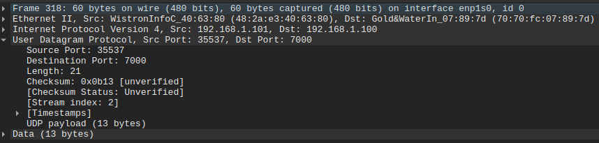

# Trabajo Práctico N° 5

### Nombres _(por órden alfabético)_
_Gil Cernich Manuel (manuel.gil.cernich@mi.unc.edu.ar)_  
_González Damián M. (damian.gonzalez@mi.unc.edu.ar)_  
_Zuñiga Ivan A. (ivan.zuniga@mi.unc.edu.ar)_

### Nombre del grupo  
_epsilon_  

### Nombre del centro educativo

_Facultad de Ciencias Exactas, Físicas y Naturales; Universidad Nacional de Córdoba_

### Nombre del curso

_Redes de Computadoras_

### Profesores _(por órden alfabético)_

_Henn Santiago M._  
_Oliva Cuneo Facundo_

### Fecha

_03-06-2025_

---

# Resumen

En el presente trabajo se detalla el desarrollo de aplicaciones cliente-servidor programadas en Ruby para la comunicación a través de los protocolos TCP y UDP, con el objetivo de analizar y comparar su funcionamiento. Se realizó la captura y el análisis de tráfico mediante Wireshark para examinar la estructura de los paquetes y se midieron métricas de rendimiento como latencia y jitter, confirmando la mayor velocidad de UDP frente a la fiabilidad de TCP. Adicionalmente, se implementó un sistema de encriptación simétrica utilizando AES-256-CBC para asegurar la confidencialidad de los datos transmitidos, verificando la encriptación de la carga útil. El informe concluye con una comparación teórica entre criptografía simétrica y asimétrica, y una propuesta conceptual para establecer un canal de comunicación seguro entre dos partes sin contacto previo, utilizando un enfoque híbrido con autenticación fuera de banda para mitigar ataques _Man-in-the-Middle_.

**Palabras clave**: _Redes de Computadoras, Ruby, TCP, UDP, Wireshark, Latencia, Jitter, Encriptación Simétrica, Encriptación Asimétrica, AES, Intercambio de Claves._

---

# **Introducción**

En el presente informe se detalla el desarrollo y los resultados obtenidos en el Trabajo Práctico N°5, centrado en el análisis de la capa de transporte y la encriptación en sistemas de comunicación. El objetivo principal de este trabajo es profundizar en los conceptos de programación de redes (networking), la captura y análisis de tráfico, y la implementación de mecanismos de seguridad para la transferencia de datos.

Para ello, se desarrollaron scripts en **Ruby** utilizando la librería core `socket` para establecer una comunicación cliente-servidor, inicialmente a través del protocolo **TCP** y posteriormente **UDP**. Se procedió al envío de secuencias de paquetes para medir y analizar métricas de rendimiento clave como la latencia y el jitter. Finalmente, se exploraron las diferencias entre la encriptación simétrica y asimétrica, aplicando un método de encriptación a la comunicación desarrollada para asegurar la confidencialidad de la información transmitida.

Este documento presenta la metodología utilizada, las herramientas empleadas, los resultados de las mediciones y un análisis comparativo de los protocolos y técnicas estudiadas, cumpliendo con todos los objetivos planteados en la guía del trabajo práctico.

---

# **Desarrollo**

_NOTA: Puede hayar todos los scripts realizados dentro del directorio **TP5/scripts**, y los logs de aquellos scripts que generan logs, dentro del directorio **TP5/logs**._ 

## 1.a) 

## Prueba de envío y recepción de paquetes TCP

### Ejecución de los scripts

<p align="center">
  
</p>
<p align="center"><b>Figura 1.</b> Cliente TCP – Ejecución del envío y recepción de mensajes.</p>

<p align="center">
  
</p>
<p align="center"><b>Figura 2.</b> Servidor TCP – Recepción y respuesta de mensajes.</p>

---

### Captura de tráfico TCP en Wireshark

<p align="center">
  
</p>
<p align="center"><b>Figura 3.</b> Tráfico TCP capturado en Wireshark. Se visualizan los paquetes enviados y recibidos, incluyendo campos de identificación como secuencia (Seq), acuse de recibo (Ack) y longitud de carga útil (Len=14).</p>

---

### Análisis de la secuencia y carga útil

- Cada mensaje transmitido incluye un identificador único incremental, por ejemplo:  
  <code>req_epsilon_0</code>, <code>req_epsilon_1</code>, ..., <code>req_epsilon_n</code>.
- Esto permite identificar y seguir la secuencia de los paquetes tanto en los logs de consola (cliente y servidor) como en la captura de Wireshark.
- En la columna **Len=14** de Wireshark se observa que la **carga útil transmitida es de 14 bytes** para cada paquete.

---

### Ejemplo de detalle de paquete TCP

<p align="center">
  
</p>
<p align="center"><b>Figura 4.</b> Carga útil de un paquete TCP en Wireshark. Se observa el desglose del paquete TCP, donde la sección "Data (14 bytes)" corresponde a la carga útil transmitida.</p>

- **Contenido de la carga útil:**  
  <code>rsp_epsilon_3</code>
- **Confirmación de la secuencia:**  
  Los números de secuencia (<code>Seq</code>) y acuse de recibo (<code>Ack</code>) permiten verificar que los paquetes se envían y reciben correctamente en orden.

## Prueba de envío y recepción de paquetes UDP

### Ejecución de los scripts

<p align="center">
  
</p>
<p align="center"><b>Figura 5.</b> Cliente UDP – Ejecución del envío y recepción de mensajes.</p>

<p align="center">
  
</p>
<p align="center"><b>Figura 6.</b> Servidor UDP – Recepción y respuesta de mensajes.</p>

---

### Captura de tráfico UDP en Wireshark

<p align="center">
  
</p>
<p align="center"><b>Figura 7.</b> Tráfico UDP capturado en Wireshark. Se visualizan los paquetes enviados y recibidos, con identificación de origen/destino, puertos y la longitud de la carga útil (Len=14).</p>

---

### Análisis de la secuencia y carga útil

- Cada mensaje transmitido incluye un identificador único incremental, por ejemplo:  
  <code>req_epsilon_0</code>, <code>req_epsilon_1</code>, ..., <code>req_epsilon_n</code>.
- Esto permite identificar y seguir la secuencia de los paquetes tanto en los logs de consola (cliente y servidor) como en la captura de Wireshark.
- En la columna <b>Len=14</b> de Wireshark se observa que la carga útil transmitida es de 14 bytes para cada paquete.

---

### Ejemplo de detalle de paquete UDP

<p align="center">
  
</p>
<p align="center"><b>Figura 8.</b> Carga útil de un paquete UDP en Wireshark. Se observa el desglose del paquete UDP, donde la sección "Data (13 bytes)" corresponde a la carga útil transmitida.</p>

- <b>Contenido de la carga útil:</b>  
  <code>rsp_epsilon_3</code>
- <b>Confirmación de la secuencia:</b>  
  Se observa que el mensaje recibido y enviado respeta el orden y contenido, según el identificador del mensaje y la información de los logs.

## 1.b)

Los scripts que incluyen esta funcionalidad solicitada son aquellos dentro de _TP5/scripts/s_encriptado_c_log_, que significa "sin encriptado, con log", que son esencialmente los mismos ejecutados en 1.a). Se hizo esta separación entre scripts que implementan encriptación y no, para aislar claramente las funcionalidades introducidas, y por lo tanto, los scripts que nacen a partir de la parte 4), fueron podados de la implementación de logs.  

Ejemplos reales de logs generados por los respectivos scripts pueden encontrarse en _TP5/logs_.

## 1.c) 

## Cálculo de latencia promedio, máxima, mínima y jitter para una secuencia de 100 paquetes

A continuación, se presentan las métricas obtenidas para TCP y UDP, calculadas a partir de la secuencia de 100 paquetes enviados y recibidos, según lo registrado en `network_stats.csv`, un archivo generado a partir de correr nuestro script `stats_generator.rb`, teniendo los debidos logs, ya generados:

| Protocolo | Latencia mínima [ms] | Latencia máxima [ms] | Latencia promedio [ms] | Jitter [ms] |
|-----------|----------------------|----------------------|------------------------|-------------|
| **TCP**   | 36.236               | 43.940               | 39.10                  | 1.67        |
| **UDP**   | 17.688               | 27.657               | 20.64                  | 1.59        |

- **Latencia**: tiempo que tarda un paquete en viajar desde el origen al destino.
- **Jitter**: variación estadística del retardo en la recepción de los paquetes.

### Observaciones

- **UDP** presenta menor latencia promedio y mínima en comparación con **TCP**, lo cual es consistente con la naturaleza sin conexión y menor sobrecarga de UDP.
- **TCP** tiene mayor latencia, debido al control de flujo, acuses de recibo y mecanismos de fiabilidad propios del protocolo.
- El **jitter** es levemente mayor en TCP (1.67 ms) que en UDP (1.59 ms), aunque la diferencia es pequeña en este experimento.


> Estas métricas fueron calculadas a partir de los logs de los scripts, empleando marcas de tiempo de envío y recepción, y analizadas posteriormente para obtener los valores mínimos, máximos, promedio y jitter para cada protocolo.


## 3) Comparación de un paquete UDP y un paquete TCP capturados

A continuación se presentan y analizan un paquete UDP y uno TCP capturados en Wireshark. Se destacan sus diferencias y se muestra una tabla comparativa para las métricas obtenidas en el punto 1.c.

---

<p align="center">
  
</p>
<p align="center"><b>Figura 9.</b> Detalle de un paquete UDP capturado en Wireshark.</p>

<p align="center">
  
</p>
<p align="center"><b>Figura 10.</b> Detalle de un paquete TCP capturado en Wireshark.</p>

---

### Diferencias principales observadas

- **Encabezado y Protocolo:**
  - **UDP** posee un encabezado de 8 bytes fijos, compuesto por los campos Puerto Origen (2 bytes), Puerto Destino (2 bytes), Longitud (2 bytes) y Checksum (2 bytes), según la especificación del [RFC 768](https://datatracker.ietf.org/doc/html/rfc768).
    - En Wireshark se puede confirmar esto restando el valor del campo `UDP payload (13 bytes)` al campo `Length: 21`, resultando en 8 bytes de encabezado.
  - **TCP** tiene un encabezado mínimo de **20 bytes** (sin opciones) y puede ser mayor si incluye campos opcionales, tal como indica el [RFC 793](https://datatracker.ietf.org/doc/html/rfc793). En la captura, el encabezado TCP tiene 32 bytes debido a la presencia de opciones (NOP, Timestamps, etc.).
- **Tamaño total del paquete:**
  - **UDP:** 60 bytes en total (payload 13 bytes).
  - **TCP:** 80 bytes en total (payload 14 bytes).
- **Campos exclusivos de TCP:**
  - Números de secuencia y acuse de recibo (control de flujo y fiabilidad).
  - Flags (PSH, ACK, etc.).
  - Opciones (NOP, Timestamps).
- **Carga útil (payload):**
  - **UDP:** "Data (13 bytes)"
  - **TCP:** "Data (14 bytes)"
  - Diferencia debida a la construcción del mensaje en la aplicación y/o a la inclusión de caracteres de control.

---

### Tabla comparativa de métricas de red

| Métrica              | Paquete TCP                     | Paquete UDP                 |
|----------------------|---------------------------------|-----------------------------|
| Protocolo            | TCP                             | UDP                         |
| RFC                  | RFC 793                         | RFC 768                     |
| IP Origen            | 192.168.1.100                   | 192.168.1.101               |
| IP Destino           | 192.168.1.101                   | 192.168.1.100               |
| Puerto Origen        | 4000                            | 35537                       |
| Puerto Destino       | 51046                           | 7000                        |
| Longitud total       | 80 bytes                        | 60 bytes                    |
| Tamaño encabezado    | 32 bytes (TCP + opciones)       | 8 bytes (fijo por RFC 768)  |
| Carga útil (payload) | 14 bytes                        | 13 bytes                    |
| Fiabilidad           | Sí (control de flujo y errores) | No (sin control de errores) |
| Orientado a conexión | Sí                              | No                          |


### Observaciones adicionales

- **TCP** proporciona mayor fiabilidad y control de la transmisión de datos, a costa de mayor sobrecarga y latencia.
- **UDP** es más eficiente en cuanto a tamaño de encabezado y menor latencia, pero no garantiza la entrega ni el orden de los paquetes.
- La diferencia de 1 byte en la carga útil puede estar asociada a cómo la aplicación genera el mensaje (por ejemplo, inclusión o no de un salto de línea o carácter nulo).

---

## 4. a)

## Encriptación Simétrica vs Asimétrica

### Encriptación Simétrica

#### Principio Fundamental
- **Una sola clave:** Utiliza la misma clave secreta tanto para cifrar como para descifrar los datos.
- **Clave compartida:** Tanto el emisor como el receptor deben poseer la misma clave antes de la comunicación.

#### Características Principales
- **Velocidad:** Significativamente más rápida y menos intensiva computacionalmente.
- **Eficiencia:** Ideal para cifrar grandes volúmenes de datos.
- **Algoritmos comunes:** AES, DES, 3DES, Blowfish.

#### Ventajas y Desventajas
**Ventajas:**
- Proceso de cifrado muy rápido.
- Consume menos recursos computacionales.
- Eficiente para grandes cantidades de datos.

**Desventajas:**
- **Distribución de claves:** La clave debe compartirse de forma segura previamente.
- **Riesgo de compromiso:** Si la única clave se filtra, todos los datos quedan expuestos.
- Considerada menos segura para comunicaciones entre partes desconocidas.

---

### Encriptación Asimétrica (Clave Pública)

#### Principio Fundamental
- **Par de claves:** Utiliza dos claves matemáticamente relacionadas pero distintas:
  - **Clave pública:** Se puede distribuir abiertamente.
  - **Clave privada:** Se mantiene en secreto absoluto.
- **Cifrado cruzado:** Lo que se cifra con una clave solo se puede descifrar con la otra.

#### Características Principales
- **Velocidad:** Considerablemente más lenta que la simétrica.
- **Seguridad:** Basada en problemas matemáticos complejos (factorización de números primos, logaritmos discretos).
- **Algoritmos comunes:** RSA, ECC, Diffie-Hellman, DSA.

#### Ventajas y Desventajas
**Ventajas:**
- **Gestión de claves simplificada:** No necesita intercambio previo de secretos.
- **Autenticación:** Permite verificar la identidad del remitente.
- **No repudio:** El emisor no puede negar haber enviado el mensaje.
- **Firmas digitales:** Permite verificar integridad y autenticidad.

**Desventajas:**
- Proceso de cifrado más lento.
- Consume más recursos computacionales.
- Menos eficiente para grandes volúmenes de datos.

---

### Comparación Directa

| Aspecto                    | Simétrica (Clave Secreta)      | Asimétrica (Clave Pública/Privada) |
|----------------------------|--------------------------------|------------------------------------|
| **Número de claves**       | 1 (secreta compartida)         | 2 (pública y privada)              |
| **Velocidad**              | Rápida                         | Lenta                              |
| **Recursos**               | Pocos                          | Muchos                             |
| **Gestión de claves**      | Compleja (distribución segura) | Simple (clave pública abierta)     |
| **Uso principal**          | Grandes volúmenes de datos     | Intercambio de claves, firmas      |
| **Tamaño de clave típico** | 128-256 bits (AES)             | 2048+ bits (RSA), 256+ bits (ECC)  |

---

### Sistemas Híbridos

En la práctica, la mayoría de sistemas modernos utilizan ambos tipos combinados:

#### Criptografía asimétrica para:
- Intercambio seguro de claves
- Autenticación inicial
- Firmas digitales

#### Criptografía simétrica para:
- Cifrado masivo de datos
- Comunicación eficiente durante la sesión

**Ejemplo típico:** HTTPS (SSL/TLS)
- Se usa RSA/ECC para intercambiar una clave simétrica de sesión.
- Se usa AES para cifrar todo el tráfico web con esa clave de sesión.

> Esta combinación aprovecha lo mejor de ambos mundos: la seguridad en el intercambio de claves de la asimétrica y la eficiencia de la simétrica para el cifrado masivo de datos.


## 4.b) Investigación y selección de librería para encriptar mensajes

Para asegurar la confidencialidad de los mensajes transmitidos en nuestros scripts, optamos por utilizar la librería estándar de Ruby `openssl` junto al algoritmo **AES-256-CBC**. Esta combinación permite implementar cifrado simétrico robusto.

### Principales características de `openssl` con AES-256-CBC en Ruby

#### Integración estándar
`openssl` es parte de la biblioteca estándar de Ruby, lo que evita dependencias externas y facilita su uso inmediato en cualquier entorno Ruby.

#### Soporte de cifrado fuerte
Permite implementar cifrados simétricos (como AES, DES, Blowfish) y asimétricos (como RSA), firmas digitales y funciones hash.

#### Flexibilidad y control
El desarrollador puede elegir el modo de operación (CBC, ECB, GCM, etc.), el tamaño de clave y los detalles del proceso de cifrado/descifrado.

#### Amplio respaldo
`openssl` es un estándar en la criptografía de software, está auditado y soportado en múltiples lenguajes y sistemas.

### Ejemplo de uso en el script

En nuestra implementación, tanto el cliente como el servidor cifran y descifran la carga útil (los mensajes) usando AES-256-CBC, una clave secreta compartida (`KEY`) y un vector de inicialización (`IV`).

El mensaje cifrado se codifica en Base64 para ser transmitido por el socket. Luego se descifra en el receptor usando los mismos parámetros.

```ruby
ENCRYPTION_METHOD = 'AES-256-CBC'.freeze
KEY = 'G7kL9vTqNpXzJwErUyOiPmDfHsQaZxVc'.freeze
IV = 'mNzRgTpYwQsEdCfV'.freeze

def set_enc_key_iv(enc)
  enc.key = KEY
  enc.iv = IV
  enc
end

def get_cipher
  cipher = OpenSSL::Cipher.new(ENCRYPTION_METHOD)
  cipher.encrypt
  set_enc_key_iv(cipher)
end

def get_decipher
  decipher = OpenSSL::Cipher.new(ENCRYPTION_METHOD)
  decipher.decrypt
  set_enc_key_iv(decipher)
end

# Para cifrar:
cipher = get_cipher()
encrypted_data = Base64.strict_encode64(cipher.update(data) + cipher.final)

# Para descifrar:
decipher = get_decipher()
decrypted_data = decipher.update(Base64.decode64(encrypted_data)) + decipher.final
```

### Ventajas de la solución elegida

#### Seguridad comprobada
AES-256 es un algoritmo ampliamente auditado, considerado seguro para datos sensibles.

#### Velocidad y eficiencia
El cifrado simétrico (una sola clave) es rápido y eficiente, ideal para cifrar grandes cantidades de datos o transmisiones en tiempo real como UDP/TCP.

#### Portabilidad
Al ser parte de la biblioteca estándar, se puede utilizar en cualquier sistema compatible con Ruby.

### Consideraciones y buenas prácticas

#### Gestión de claves
En un sistema real, la clave secreta y el IV no deberían estar hardcodeados. Deben manejarse de forma segura (variables de entorno, vault, etc).

#### Integridad y autenticidad
AES-CBC cifra los datos pero no garantiza su integridad. Para máxima seguridad, se recomienda agregar un HMAC o utilizar modos autenticados como GCM.

## 4.c) 

## Identificación de la carga útil encriptada en los paquetes transmitidos

Se ejecutaron los scripts de cliente y servidor utilizando cifrado AES-256-CBC para encriptar la carga útil antes de su envío. A continuación, se selecciona un paquete aleatorio de la secuencia para analizar su contenido.

---

### Ejemplo de paquete UDP encriptado

<p align="center">
  
</p>
<p align="center"><b>Figura 11.</b> Captura de un paquete UDP encriptado (Wireshark). El campo <code>Data (24 bytes)</code> muestra datos encriptados y codificados en base64.</p>

---

### Ejemplo de paquete TCP encriptado

<p align="center">
  
</p>
<p align="center"><b>Figura 12.</b> Captura de un paquete TCP encriptado (Wireshark). El campo <code>Data (25 bytes)</code> muestra datos encriptados y codificados en base64.</p>

---

### Visualización de la decodificación en el servidor UDP

<p align="center">
  
</p>
<p align="center"><b>Figura 13.</b> Consola del servidor UDP mostrando la carga útil recibida encriptada y el mensaje desencriptado.</p>

---

### Visualización de la decodificación en el servidor TCP

<p align="center">
  
</p>
<p align="center"><b>Figura 14.</b> Consola del servidor TCP mostrando la carga útil recibida encriptada y el mensaje desencriptado.</p>

---

### Visualización del proceso de cifrado y descifrado en el cliente UDP

<p align="center">
  
</p>
<p align="center"><b>Figura 15.</b> Consola del cliente UDP mostrando los mensajes enviados/recibidos, tanto cifrados (base64) como descifrados.</p>

---

### Visualización del proceso de cifrado y descifrado en el cliente TCP

<p align="center">
  
</p>
<p align="center"><b>Figura 16.</b> Consola del cliente TCP mostrando los mensajes enviados/recibidos, tanto cifrados (base64) como descifrados.</p>

---

### Comparación con tramas no encriptadas (ítems 1.a y 2.a)

En los ítems anteriores, la carga útil transmitida era visible y legible en texto plano tanto en los logs de la consola como en las capturas de Wireshark. Por ejemplo, en una comunicación UDP o TCP sin cifrado, el mensaje enviado podía observarse claramente como:

- **UDP:**  
  `req_epsilon_0`
- **TCP:**  
  `req_epsilon_0`

Esto significa que cualquier persona con acceso a la red y a las capturas de tráfico podía leer directamente el contenido del mensaje transmitido, sin ninguna protección frente a terceros.

Sin embargo, en la implementación actual con cifrado, la carga útil que viaja por la red ya no es el mensaje original en texto plano. Ahora, lo que se transmite es el resultado de aplicar un algoritmo de cifrado (en este caso, AES-256-CBC) a ese mensaje. Además, para garantizar que pueda enviarse por el socket sin problemas de formato, se codifica en Base64, obteniendo cadenas como:

`+9TTMmoRVEONWPeoaTxVrQ==`

Este código no tiene ningún significado legible para un observador externo:  
- No representa el mensaje original ni revela ninguna información sobre su contenido.
- Solo puede ser descifrado y convertido nuevamente en el mensaje original (`req_epsilon_0`, `rsp_epsilon_1`, etc.) por el receptor, que posee la misma clave secreta y el vector de inicialización adecuados.

Esto implica que aunque se intercepte el paquete en la red, el contenido permanecerá oculto y seguro para cualquier atacante que no disponga de la clave correcta.

_NOTA: Por cuestiones prácticas y didácticas, dentro de los scripts que implementan encriptación, encontrará la **KEY** (Encryption Key) y el **IV** (Initialization Vector) hardcodeados. Por supuesto que en código de producción, esto no puede estar allí, sino que debiera ser cargado a memoria, por ejemplo, a través de algún mecanismo como la utilización de variables de ambiente._

## 4. d)

Para encriptar la comunicación entre dos computadoras remotas que nunca han intercambiado información, se debe utilizar una combinación de criptografía asimétrica y un protocolo de intercambio de claves, autenticando la comunicación mediante un canal secundario para evitar ataques.

Conceptualmente, la implementación en scripts seguiría estos pasos:

1.  **Generación de Claves**: Cada computadora genera un par de claves asimétricas (una pública y una privada) y un par de claves efímeras para el protocolo Diffie-Hellman (DH).
2.  **Intercambio de Claves Públicas**: Las computadoras intercambian sus claves públicas asimétricas y sus claves públicas DH a través de la red principal (insegura).
3.  **Autenticación Fuera de Banda (OOB)**: Este es el paso crucial. Para asegurar que las claves públicas recibidas son auténticas y no de un atacante, los usuarios calculan una "huella digital" (un hash corto) de sus claves públicas. Luego, comunican estas huellas a través de un canal secundario y seguro, como una llamada telefónica o videoconferencia, donde pueden verificar la identidad del otro.
4.  **Verificación y Creación del Secreto**: Cada usuario compara la huella recibida por el canal seguro con la que calcula de la clave pública recibida por la red. Si coinciden, la clave es auténtica. Con las claves DH autenticadas, ambas máquinas calculan una shared secret key idéntico sin que este haya sido transmitido directamente.
5.  **Comunicación Cifrada**: Esta shared secret key se usa para derivar una clave de sesión simétrica (ej. AES), que cifra de manera eficiente toda la comunicación posterior.

Este método, que combina la criptografía de clave pública para el establecimiento de confianza con la criptografía simétrica para la comunicación continua, se conoce como **criptografía híbrida**.

---

### El Desafío de la Confianza Inicial

Establecer un canal de comunicación seguro entre dos computadoras geográficamente distantes sin interacción previa presenta un desafío fundamental en seguridad informática. La comunicación debe ocurrir a través de una red pública potencialmente hostil, como Internet, donde los datos pueden ser interceptados. Para proteger la información, se deben garantizar tres pilares esenciales:

* **Cifrado (Confidencialidad)**: Transforma los datos en un formato ininteligible (texto cifrado) usando una clave. Solo quien posea la clave correcta puede acceder a la información original, protegiéndola de entidades no autorizadas.
* **Autenticación**: Permite verificar la identidad de las partes, asegurando que no se está comunicando con un impostor. Es la defensa principal contra ataques de suplantación y de Hombre en el Medio (Man-in-the-Middle o MitM).
* **Integridad**: Garantiza que los datos no han sido alterados durante la transmisión. Mecanismos como las firmas digitales permiten al receptor verificar que la información recibida es idéntica a la enviada.

La condición de que las computadoras "nunca han intercambiado información" elimina la posibilidad de usar claves simétricas precompartidas, haciendo indispensable un mecanismo para establecer una primera `Secret Key` de forma segura.

---

### Fundamentos Criptográficos

Para resolver este problema, nos basamos en dos pilares de la criptografía moderna: la criptografía asimétrica y el intercambio de claves Diffie-Hellman.

#### Criptografía Asimétrica

Este proceso ya ha sido desarrollado en apartados previos de este informe.

#### Intercambio de Claves Diffie-Hellman (DH)

El protocolo DH permite a dos partes, sin conocimiento previo entre sí, establecer una shared secret key a través de un canal inseguro. Ambas partes acuerdan parámetros públicos (un número primo `p` y un generador `g`). Luego, cada una elige un número secreto privado (`a` y `b`) y calcula una clave pública DH (`g^a mod p` y `g^b mod p`) que intercambian. Al recibir la clave pública de la otra parte, ambas pueden calcular la misma shared secret key (`(g^b)^a mod p` = `(g^a)^b mod p`) sin haberlo transmitido directamente.

La limitación crítica de DH es su vulnerabilidad a ataques **Man-in-the-Middle (MitM)**. Un atacante puede interceptar el intercambio y establecer una shared secret key con cada parte, haciéndoles creer que se comunican de forma segura entre sí, cuando en realidad el atacante está en medio, controlando toda la comunicación. Por ello, es imprescindible **autenticar** los valores públicos intercambiados.

### Estrategia de Implementación Conceptual en Scripts

A continuación se detalla una secuencia lógica de operaciones que los scripts en cada computadora realizarían.

#### Paso 1: Generación de Prerrequisitos Criptográficos (Ambas Computadoras)

Antes de cualquier comunicación, cada computadora debe generar localmente sus herramientas criptográficas.

* **Lógica**: Un script (`generar_entorno.rb`) genera un par de claves asimétricas (ej. RSA de 2048 bits) y un par de claves DH efímeras (que se usan para una sola sesión), usando las funciones de OpenSSL integradas en Ruby.
* **Resultado**: La Computadora A posee `privkey_A.pem` (secreta) y `pubkey_A.pem` (pública). Lo mismo para la Computadora B. Cada una tiene también su par de claves DH efímeras.

#### Paso 2: Intercambio de Información Pública (Canal Principal)

Las claves públicas (asimétrica y DH) se intercambian a través del canal principal, que se asume inseguro (email, chat, etc.).

* **Lógica**: Un script (`enviar_pubkeys.rb`) en A envía `pubkey_A.pem` y `pub_dh_A.pem` a B. B hará lo mismo.
* **Desafío Crítico**: La confidencialidad de estas claves no es un problema, pero su **autenticidad** sí lo es.

#### Paso 3: Autenticación de las Claves Públicas (El Paso Crucial)

Este es el paso más importante para prevenir ataques MitM. La solución más pragmática y segura para este escenario es la **verificación manual de huellas digitales a través de un canal fuera de banda (Out-of-Band - OOB)**.

* **Concepto**: Una huella digital (fingerprint) es un hash criptográfico corto y único de la clave pública (ej. SHA-256). Su corta longitud facilita la verificación humana.
* **Proceso de Autenticación**:
    1.  **Cálculo**: Cada usuario genera la huella de su propia clave pública.
    2.  **Comunicación OOB**: El usuario A llama por teléfono (o usa otro canal donde la identidad sea verificable, como una videoconferencia) al usuario B y le lee la huella de su clave. B hace lo mismo. Este canal OOB se asume auténtico.
    3.  **Verificación**: Cuando la computadora B recibe el archivo `pubkey_A.pem` por el canal principal (inseguro), calcula localmente su huella. Luego, el usuario B compara esta huella calculada con la que A le leyó por teléfono.
    4.  **Decisión**: Si las huellas coinciden exactamente, la clave es auténtica. Si no, el proceso se aborta inmediatamente, debido a que indica un posible ataque.

#### Paso 4: Cálculo de la shared secret key y Derivación de la Clave de Sesión

Una vez que cada computadora ha autenticado la clave pública de la otra, pueden proceder de forma segura.

* **Lógica**: Un script (`recibir_verificar_y_derivar.rb`) en A usa su clave privada DH (`priv_dh_A.pem`) y la clave pública DH autenticada de B (`pub_dh_B.pem`) para calcular la shared secret key `s`. B realiza el mismo cálculo.
* **Derivación de Clave**: La secret key `s` no se usa directamente. Se pasa a través de una Función de Derivación de Clave (KDF) para generar una clave de sesión simétrica robusta, `clave_simetrica_AB`.
* **Resultado**: Ambas computadoras ahora poseen una clave de sesión simétrica idéntica, sin que esta haya sido transmitida a través de la red. Las claves DH efímeras se descartan.

### Paso 5: Comunicación Continua con Criptografía Híbrida

Establecida la clave de sesión, la comunicación subsiguiente utiliza un sistema de **criptografía híbrida**, que combina la seguridad del intercambio asimétrico con la eficiencia del cifrado simétrico.

* **Lógica**: Para enviar un mensaje, un script (`enviar_mensaje_cifrado.rb`) utiliza la `clave_simetrica_AB` con un algoritmo de cifrado simétrico robusto y rápido como **AES-GCM**. Este modo es altamente recomendado porque proporciona confidencialidad, integridad y autenticación en una sola operación. El script de recepción (`recibir_y_descifrar_mensaje.rb`) utiliza la misma clave para descifrar el mensaje y verificar su integridad.

* **Eficiencia**: El cifrado simétrico es significativamente más rápido que el asimétrico, lo que lo hace ideal para cifrar el flujo de datos de la comunicación.

---

### Conclusión y Consideraciones Críticas

Es imposible subestimar la importancia del paso de **autenticación**. La seguridad de todo el sistema depende de la verificación fehaciente de las claves públicas al inicio del proceso. Un fallo en este paso invalida todas las protecciones posteriores, dejando el sistema vulnerable a un ataque Man-in-the-Middle.

Asimismo, las **claves privadas deben permanecer secretas** en todo momento y nunca ser compartidas. Su compromiso equivale al compromiso total de la seguridad.

Si bien este enfoque conceptual es una buena manera para entender los mecanismos subyacentes, las implementaciones reales son complejas y propensas a errores sutiles. Para aplicaciones de producción, es altamente recomendable utilizar protocolos estandarizados y auditados como **TLS (Transport Layer Security)**, que encapsulan esta lógica de forma robusta y segura.

---

# Conclusiones

A lo largo de este trabajo práctico, se cumplieron exitosamente los objetivos de analizar y comparar los protocolos de transporte TCP y UDP, así como de implementar una capa de seguridad para la comunicación. El análisis de rendimiento demostró cuantitativamente las ventajas de UDP en términos de menor latencia y jitter, a costa de la fiabilidad que caracteriza a TCP, validando los conceptos teóricos. La implementación de cifrado simétrico con AES-256-CBC resultó eficaz para proteger la confidencialidad de los datos, transformando la carga útil en un formato ilegible para terceros no autorizados, como se verificó en las capturas de tráfico. Finalmente, la investigación sobre criptografía y el diseño conceptual de un sistema de intercambio de claves seguro subrayaron la importancia crítica de la autenticación para prevenir ataques Man-in-the-Middle y la eficacia de los sistemas híbridos en aplicaciones del mundo real. Este proyecto permitió integrar de manera práctica los fundamentos de programación de redes, análisis de protocolos y seguridad informática.

---

# Referencias

[1] Internet Engineering Task Force. (1980). **RFC 768: User Datagram Protocol (UDP)**. Recuperado el 1 de junio de 2025 de https://datatracker.ietf.org/doc/html/rfc768  

[2] Internet Engineering Task Force. (1981). **RFC 793: Transmission Control Protocol (TCP)**. Recuperado el 1 de junio de 2025 de https://datatracker.ietf.org/doc/html/rfc793  

[3] Wikipedia contributors. (s. f.). **Trust on first use**. *Wikipedia*. Recuperado el 1 de junio de 2025 de https://en.wikipedia.org/wiki/Trust_on_first_use  

[4] Walfield, N. H. (2016). *TOFU: Trust On First Use* [White paper, PDF]. Recuperado de https://gnupg.org/ftp/people/neal/tofu.pdf

[5] Wikipedia contributors. (s. f.). **Diffie–Hellman key exchange**. *Wikipedia*. Recuperado el 1 de junio de 2025 de https://en.wikipedia.org/wiki/Diffie%E2%80%93Hellman_key_exchange

[6] Autores varios. **Ruby 3.0.X API**. Recuperado el 28 de mayo de 2025 de https://msp-greg.github.io/ruby_3_0/.

[7] Thomas, D., Fowler, C., & Hunt, A. (2009). **Programming Ruby 1.9: The Pragmatic Programmers' Guide** (4th ed.). The Pragmatic Bookshelf.
